> 本文转载自搜狐号「考拉看看」，原文发布于 2020-03-29。
> 原文链接：https://www.sohu.com/a/384135751_100000384

20多年前，段永平在中国一手缔造了"小霸王"和"步步高"两个家喻户晓的品牌。之后，他在事业巅峰时回归家庭生活，远走美国，隐退江湖。他的经营理念和商业思想，在企业界和投资界，已是"神级"人物。

考拉看看·企业家和企业史研究中心在梳理段永平的人生历程时，发现了一些与他有着各种关联的企业或品牌，小天才、OPPO、vivo、一加手机、拼多多……这些企业或品牌多多少少都受到其影响，而且彼此有着莫名的相似之处。像当年的"小霸王"和"步步高"一样，他们异军突起却又异常低调。这个世界不缺少"创业导师"，但像段永平这样，影响和引导了如此多创业的人，不多。

他已退出江湖多年，江湖却依旧流传着他的传说。

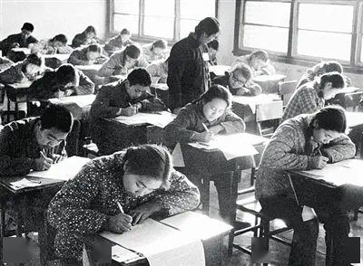
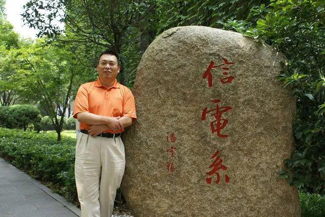

考拉看看传记组在搜索段永平相关资料时发现，这个明星企业家在网络上的公开照片非常少，视频采访也不多，但关于他的文章却很多。诸如《小霸王与段永平的传奇时代》《段氏春秋:段永平和他的段系六君子》《中国股神段永平的投资之道》等。

在做企业的时候，他的产品品牌比他有名；在做投资人的时候，他的雪球账号"大道无形我有型"比他的真名有名。许多人在网上称他为"阿段"，与他分享投资心得。在雪球上，他开通了付费提问，所收费用捐给公益机构。他幽默地说：我有不回答任何问题的权利，虽然这种情况不常见。

## 井冈山下

江西南昌因"昌大南疆、南方昌盛"而得名，中国共产党第一支独立领导的人民军队在这里诞生。1961年，段永平出生在这个被誉为军旗升起的地方。

因父母是教师，所以在知青下乡时期，一家三口来到了井冈山脚下。此地属于罗霄山脉的中段，距离南昌市约300公里，距离井冈山市区40公里，是个偏僻的乡村。

"小学我读的是复式学校，1至3年级集中在一个班上。教室很破烂，我们学种稻子、上农机课。农忙时节，也跟着大人们抢收抢种，没日没夜地干农活。"段永平回忆说。

小学四年级，劳动课上要求大家上山砍柴。九岁的段永平凌晨四点钟就起床，天还未亮，得走二十里路到深山去。午饭只能吃几口带去的干粮。

"挑柴回来的路感觉很漫长，特别是最后几里路。完全是一步一步数着到家的。回到家一般都八九点了，整个人完全像散了架似的。"段永平说，他的意志力就是在那段岁月里磨砺出来的。后来的难，和吃不饱穿不暖比起来，都不算什么。

上山砍柴、下田种稻，爬树捉鸟、下河摸鱼，成为他至今难忘的童年小事。那是个物质和知识都匮乏的年代，但它磨炼了人的意志力，这是书本上学不到的东西。

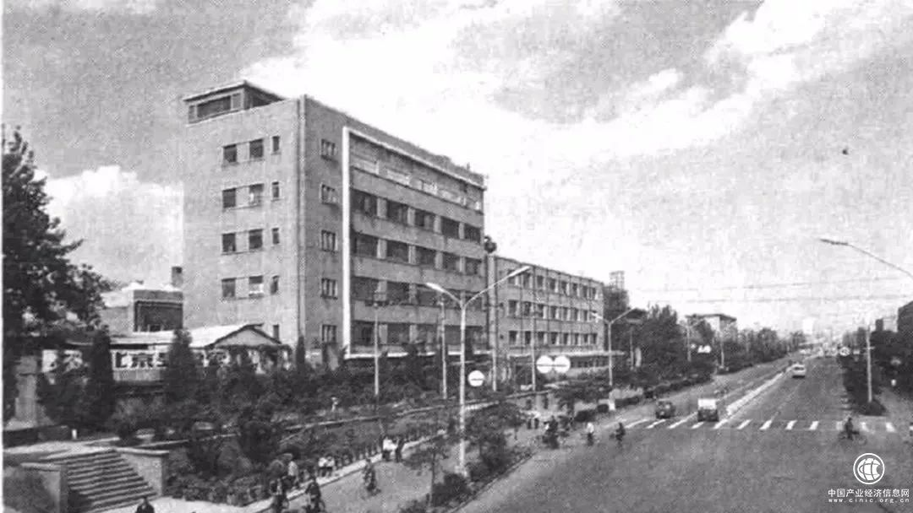

## 浙大学子

1977年，全国高考恢复。此时，段永平刚刚高中毕业不久。

恢复高考的消息一传出，全国上下反响强烈，几百万学子跃跃欲试。一大批二三十岁的青壮年男女，从车间、从田地、从军营……争先恐后地走进考场，他们希望通过这场考试改变自己和国家的命运。

在凤凰网于2017年推出的"恢复高考40年"栏目中，北大教授陈平原讲到"饥饿与求知"：我曾问我的学生，第一，你有没有饥饿的感觉？第二，有没有求知的欲望？而我们那代人是两者结合在一起的。有饥饿的感觉，有强烈的求知欲望。

段永平也不例外，带着饥饿和求知欲参加了高考。可是，成绩下来却不尽人意，总分才考了八十多分。"那个年代高考的意义就是一切。所有的人生目标都浓缩到这里，我恨不得用一切聪明智慧和时间来换取这张入场券！"段永平说，当年浓缩的学习方法、充实的拼搏生活还历历在目。

半年后，国家又举行了第二次高考。他付出的汗水终于换得了梦寐以求的大学入场券。五门课程，总分500分，他考出了四百多分的好成绩。

可当他接到浙江大学无线电系（1986年更名为信息与电子工程学系）寄来的录取通知书时，内心却突然变得非常平静，甚至有一种从未经历过的迷茫。"我觉得桃子变味了。就是在那一瞬间，我悟到了'人生的乐趣在于它的过程'这一道理。"

多年之后，段永平也将这一段心得告诉过很多人，"人生要快乐的话，就要不断的有一个合理的目标。这样生活才充实、有乐趣。"

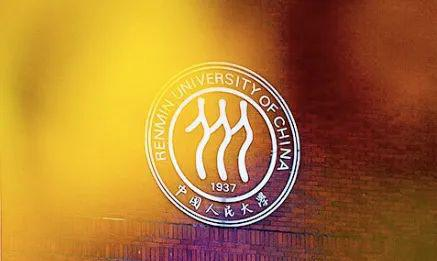

## 不当"北漂"

1982年，大学毕业的段永平，被分配到北京电子管厂工作。这个厂成立于1953年，原本是电子工业部所属的774厂，"一五"计划期间由苏联援建。

电子管是一切电子产品的核心元件。在上世纪五十年代，国家给电子工业总投资5.5亿元，北京电子管厂就占了五分之一，拥有近万名工人，是当时亚洲最大的电子元器件厂。

但改革开放后，中国大量引进外国技术和产品，电子管技术被更先进的半导体技术取代。也就是在段永平进厂的时候，工厂效益受到市场竞争冲击，开始走下坡路。1985年，电子管厂的产量下降到仅为巅峰期的百分之几，厂里近一年都发不出工资。

初出茅庐的段永平，感到了前途渺茫。同时，他也看到了差距。有一位从杭州电子工业学院毕业的大学生，比他大4岁，两人同期进厂。这位大学生处事也比段永平成熟些，很快受到了领导们的青睐，第二年就被提拔成副科长，不到六年就当上了财务处处长。

段永平不想把自己大好的青春和后半辈子耗费在这里。于是，24岁的他放弃了外人眼里的"铁饭碗"，再次一头扎进书海，考取了中国人民大学硕士学位。

有别于在本科时期所学的工科专业，段永平选择了经济系计量经济学作为研究生专业。经济学是一门研究价值的创造、转化和实现的学科，这令段永平拥有了更多独立思考的角度，同时，也打开了他的商业视野。

1988年，研究生毕业的段永平，可谓是"高精尖"人才。不管是进国家机关还是大型国企，都很容易。有不少单位向他抛出"橄榄枝"，许诺他过几年就能当处长，还能分房子。但他对这些不感兴趣，甚至不想留在北京。

这样的想法，在当时的社会有些另类。上世纪70年代末，一大批人涌进"北上广"打工。因为谋生或者其他原因，没有介绍信、没有户口的他们，成了第一代"北漂"。那时，民间流传着"销北京户口跟放屁那么容易，上北京户口比生孩子还难"的说法。而段永平原本能够得到北京户口，但却选择了放弃。

"当时觉得北京的官本位思想比较浓厚，对我这种普通家庭出身的人而言，成功的概率不大。"于是，学经济出身的段永平，去到了思想开放、因经济发展而急需人才的南方沿海城市。

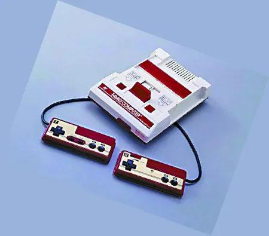

## 小霸王之父

带着一身文气，段永平来到了广东中山。这是市场经济落地生根的地方。此时，正值改革开放春潮涌动。即将迈入而立之年的他，也不愿错过这趟开往春天的列车。

1989年，带着两张重点大学的文凭，他应聘进了怡华集团旗下的佛山日华电子厂。怡华集团是综合性大型企业集团，业务涉及到旅游、贸易、工业、文化等多方面，实力在中山市排名前三。凭借着杰出的工作能力，不到一年，段永平便荣升为电子厂厂长。

但段永平一上任，就遭遇了挑战。因为日华电子厂的亏损额已高达200多万元，濒临倒闭。

面对如此困境，段永平没有退缩。他从市场调查入手，多次调研后发现，日华电子厂主打的大型电子游戏机即将被消费者淘汰，而小型游戏机却很有市场前途。

此时，如日中天的日本任天堂公司，推出了一款可以在家玩、并且支持更换卡带玩多种游戏的红白游戏机。这款游戏机一经推出，便受到了全球游戏爱好者的追捧。

不过，任天堂的产品漂洋过海来到中国，售价却高达上千元，让很多消费者望而却步。毕竟，上个世纪八十年代的中国，工人一个月的工资也就一百元左右。

段永平在市场调研中找到了突破口。有着游戏机生产技术基础的日华，依葫芦画瓢，很快就造出了外观、功能和红白机极其相似的游戏机。同时，他适时地在游戏机外增加了一个计算机键盘和电脑学习卡，通过电视机做显示屏，就组成了一套电脑学习系统，一种叫"学习机"的新产品横空出世。

在一次饭局上，段永平和朋友闲聊，提到厂里的新产品还没有确定品牌名字。结果，朋友随口一句"不如叫小霸王"，这让他瞬间觉得耳目一新。

"一方面，'小霸王'三个字很有个性、容易记住。另一方面，'霸王'虽然很霸气，但是前面的'小'字可以中和。所以觉得挺好的。"段永平说，小霸王的传播性和意义性都不错，这对于一个刚建立的品牌来说，是挺合适的。

要想在激烈的市场竞争中脱颖而出，必须重视营销。为了提高小霸王的知名度，段永平不惜花40万元请来成龙为学习机代言，并打造出脍炙人口的广告词——同是天下父母心，望子成龙小霸王。

"看似金额巨大，但我认为这是最省钱、最高效传播的方法。因为明星宣传，可能播三次'小霸王'就被人记住，但要是没有明星，可能播八次十次才被人记住。"段永平说，只要这条广告因明星的代言，而提高了记忆度、印象度或者是好感度，就已经是赚到了。

游戏功能深受孩子们喜欢，寓教于乐又让家长放心，两者兼顾，加上明星效应，小霸王学习机成为爆品，迅速占领全国80％市场份额，成为家喻户晓的电子品牌。

直到今天，很多80、90后提到小霸王学习机也是热血沸腾，甚至张口就能哼唱出游戏的背景音乐。超级玛丽、魂斗罗、冒险岛、坦克、马戏团……各类游戏画面，浮出脑海。哪里能得到隐藏道具、如何操作拥有无限条生命、怎样跳跃才能扯下通关后的小旗……各种技巧，手到擒来。

1991年，小霸王电子工业公司正式成立。三年后，"小霸王"年产值达到4亿元。1995年，小霸王年产值高达10亿元，成为了当年怡华集团最赚钱的项目，缔造了一代神话。

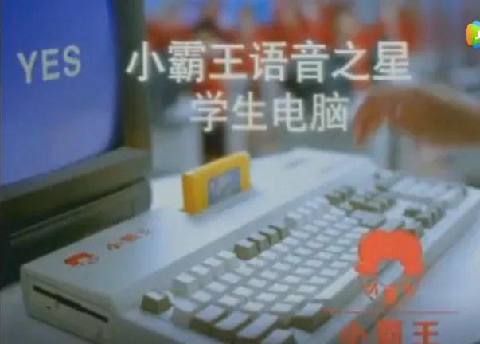

仅6年时间，日华电子厂不仅起死回生，而且达到巅峰。段永平更是因此一战成名，成为了商界新星，拥有了上千万元的年薪报酬，成为了令人羡慕的"打工皇帝"。

然而，接下来的事情并非一帆风顺。

## 创立步步高

小霸王盈利颇丰，段永平大袖一挥将20%的利润分给了下属。他用报纸裹现金给基层工人发年终奖，小报纸装不下了，就用大报纸包，据说光是报纸就用了十几摞。当时厂里的4名研发顾问，甚至分到了超过10万元的年终奖。在90年代，这样的一笔钱可以在深圳买下一处像样的房产。

但正是因为这样的做法，使得他和怡华集团的矛盾逐渐扩大。集团并不支持他如此"挥霍"地发放奖金。1995年，段永平提出的股改请求被否，成为他"出走小霸王"的导火索。

在离开之前，集团要求他签订一份协议，要求他不允许私自研发和小霸王相关、类似的产品，不可以和怡华集团产生正面竞争，但是可以得到一台奔驰车作为奖励。

和段永平一起离开的，还有六位追随者，其中包括：陈明永、沈炜和金志江。陈明永是日后OPPO的CEO，沈炜掌管vivo，而金志江在多年后管理步步高教育。

这些人在怡华集团也是业务骨干，原公司舍不得他们走掉，还特意派人将他们留下，然而他们说："我们只是水手，段永平是船长。如今船长都不在了，水手不知道船会开往哪里！"

美国麻省理工大学(MIT)斯隆管理学院资深教授彼得·圣吉曾说，职业经理人和商业领袖是有区别的，前者也许能把生意做好，而后者不仅可以做到，还能吸引到忠心的追随者。段永平，显然是后者。

辞职之后的段永平，仍然觉得电子产品在中国有很多商机。加上有团队支持，他选择了与中山只有一江之隔的东莞长安镇，另辟一片天地。在1995年9月18日，他注册成立了步步高公司，成员共七人。

步步高一成立，段永平就着手将公司改成股份制。中层管理者可以直接入股，代理商可以直接入股，甚至最基层的员工也有机会直接入股。

全员控股的管理手段在90年代就已经开始出现。1990年，华为第一次提出内部融资、员工持股的概念。当时参股的价格为每股1元，以税后利润的15%作为股权分红。

段永平也采取了这样的方式。他采取民主办法，提出人人都能入股。如果你没钱，又想入股，他可以借钱给你，回头用分红和股利再还回来即可。步步高的股权制度跟华为一样，员工持有的是虚拟股份，通过工会代持，只拥有分红权，没有投票权。

随着全员持股的推进，段永平原本70%的股权被逐渐稀释到不足20%。正是这样的策略让这家起初仅有7人的公司，在一个月之内，管理人员就增加到40人。一个月后，仍然有许多的小霸王团队的人才前来"投奔"段永平，而且还吸引了很多基层工人。步步高体系中的每个人，都成为了利益共同体的一部分，为共同的目标而奋斗。

初创时，借着仅一份的俄罗斯外销游戏机订单，步步高开始运转。尽管未来不可知，但大家对公司的未来充满信心，段永平也斗志昂扬，表现出无所畏惧的决心和勇气。他甚至定下目标：三年之内赶超小霸王，成为行业第一！

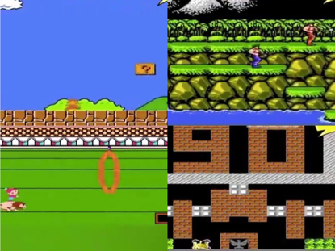

## 争市场，塑渠道

万事开头难，步步高打开"俄罗斯大门"的道路非常艰难。当时俄罗斯民众普遍对于中国货持否定的态度，几乎所有的产品都不能标记"中国制造"，但步步高没有这样做。它因此遭遇俄罗斯客户毁约的危机，刚刚起步便陷入资金困难。

而且祸不单行，段永平投资的电子宠物机项目"电子小鸡"宣告失败，这对已经出现资金周转问题的公司来说是雪上加霜。

但是，段永平没有轻易放弃。通过电子小鸡的投资失败，他意识到产品和研发的重要性，他们要做适合自己的产品，自己会做、能做的产品。质量过硬的产品永远能站住脚跟。此时，他将公司战略方向明确到电话和VCD两大产品上。

1996年，步步高电话机推出了无绳电话和子母机产品。一条线路、两部电话，加上电话的来电显示功能，成为当时的电话产品中更便利的高端产品。

紧接着，段永平开始按照小霸王的营销方式拍摄广告。小男人"尴尬"系列广告由此问世。在广告中，戴眼镜的小眼睛男人接起有来电显示的无绳电话问道："喂，小丽啊？"这句简单的广告词几乎瞬间传遍全国。

通过重视产品，加上强大的营销手段，段永平再次打造出爆款。在1998年，步步高占领了全国电话市场第一的位置。

1999年，步步高VCD问世。此时，段永平洞察到电视普及后，央视广告将能带来巨大的流量，于是决定搞件大事，和爱多VCD竞争央视春晚广告。当时，爱多的年销售收入16亿元，是步步高的主要竞争对手。

两大品牌并非第一次争夺广告资源。考拉看看发现，1997年，爱多以2.1亿元的竞标价格打败了步步高，抢得央视"标王"。但有些讽刺的是，三年前还没从小霸王离职的段永平曾派人去一家小厂打假，厂长就是爱多的创始人胡志标。

过后两年，段永平在脚踏实地奋斗时，胡志标却因经营问题陷入资金链紧张的危机，无暇顾及竞争。1999年，段永平只花了1.59亿元就成为了春晚零点报时的赞助商。

步步高VCD的电视广告由当红武术明星李连杰代言。一句"世间自有公道，付出总有回报；说到不如做到，要做就做最好，步步高"成为经典，和当年的小霸王"望子成龙"一样深入人心。

步步高开始迎来了爆发期，公司从最初的7人，增至2000年的1万人。有人说段永平擅长做电子产品，但是不懂创新。但段永平说自己是"敢为天下后"，不用做技术创新的源头，而是等待技术的成熟。

他认为，步步高是一家消费者导向的公司，最重要的是发现并满足消费者的需求，说创新技术并没有太大意义。"研发要根据消费者的需求，尊重消费者的意见来进行，多进行市场调查，开发出老百姓接受的产品，而不是自己主观搞一些噱头，为了差异化而差异化。"

在公司走上正轨之后，段永平却决定取消销售部门，成为一家靠销售驱动却没有销售部的企业。步步高的全渠道实行一套简单的办法：经销期商不分大小级别，统一提货价。不过，制订并推行这套运作系统却用了整整三年。

段永平解释说："刚刚开始经营时，我就发现每天绝大部分时间都花在和不同的客人讨价还价上面了。我当时想，我们还是这么小的生意，那将来怎么办？我们建立了起这套系统，这样就不用整天花时间讨价还价了，（做到）简单不容易。"

实际上，与建立规则相比，获取人心、赢得经销商的信任更需要时间。当年，厂家和顾客之间往往隔着多层经销商，段永平的决策极具创新性和前瞻性，同时也不被许多人理解，甚至遭遇经销商反对。如其所说，"要建立与经销商的信任很难，需要花时间"。但他同时具有"相信的人自然会留下"的信心。

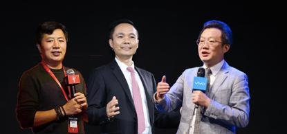

## 移居美国

1998年，正处于事业高峰期的段永平遇见一位即将改变他生活轨迹的女人——刘昕，她于1968年出生在中国四大古都之一、丝绸之路起点的西安。

两人是中国人民大学的校友。1989年，段永平研究生毕业，刘昕还在新闻系本科读大三。大四毕业后，刘昕凭实力顺利进入《中国青年报》，成为当时中青社唯一一名女摄影记者。在事业上，她是一个外柔内刚的女强人。

刘昕非常关注社会弱势群体。第一次参加"希望工程"主题摄影时，她的作品便被中国青少年发展基金会买了下来，用作招贴画。此后，她也一直致力于用镜头记录弱势群体的真实生活，希望能让更多人关注他们，改善他们的生存现状。

尽管在事业上已小有成就，但刘昕并不满足于此。1993年，她从《中国青年报》辞职，远赴美国俄亥俄大学视觉传播学院，攻读硕士学位。

1996年，研究生毕业前夕，刘昕前往《迈阿密先驱报》实习，依然专注于记录社会弱势群体。之后，她成为了《棕榈滩邮报》的首席摄影记者。棕榈滩位于美国佛罗里达州东南部，此地豪宅众多，被誉为富豪聚集地。

在《棕榈滩邮报》，她充分发挥摄影天赋，获得很多摄影专业奖项。比如，美国南部最佳摄影记者、亚特兰大全美摄影年赛冠军等。1997年，她还成功入选世界新闻摄影基金会大师班。

1998年，刘昕在回国探亲时，与段永平相恋了。

眼前这名女摄影记者的光芒吸引了段永平，在短暂的2个月时间，两人迅速擦出了爱情的火花。37岁的段永平和30岁的刘昕"闪婚"，认定对方就是自己的终身伴侣。

人生天地之间，若白驹之过隙，忽然而已。眼看着心爱的人即将回美国，段永平内心万分不舍，刘昕的发展重心在美国，但此时步步高正是向巅峰进发的时候，他不能轻易离开。

他向刘昕承诺，等他将步步高推上新的台阶之后，便会去美国与她一起生活。段永平说："当初约定好了，绿卡办下来跟她去美国，不然人家不会嫁我。"结婚以后，段永平尽可能抽时间去美国看望妻子。

大家都以为婚后的刘昕会放缓事业的步伐，转向相夫教子。然而，她辞去了原先的工作，成为了一名独立摄影师兼自由撰稿人，依然"在路上"行走着，这期间拍摄的作品都刊登在《时代周刊》《新闻周刊》等著名传媒上。

1999年，刘昕的新闻作品《双胞胎》获得了美国新闻界的最高荣誉——"普利策奖"提名。考拉看看发现，这一作品依然关注弱势群体，表现了一对孪生姐妹的家庭故事，姐姐失聪失明而且无法站立，妹妹是一个健康的孩子，姐妹由年迈的奶奶抚养，生活十分艰苦。

同一年，段永平被《亚洲周刊》评为亚洲20位商业与金融界"千禧行业领袖"之一，其"清晰的远见和创新能力"被广泛认可。

2001年年初，美国绿卡批下来了。尽管还没做好足够的离开准备，段永平也没有食言："不可能让太太在美国，我在中国，那还要这个家干什么?"这种宁负天下也不负红颜的举动，成为一段佳话。

"如果说你因为工作，那么你就完全不理家，不在乎妻子的感受，不在乎小孩所想得到的东西。我个人是认为那是一种自私……"2002年底，他正式移居美国，和妻儿团圆。

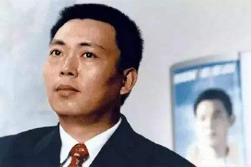

## 成为投资人

绿卡办下来后，段永平遵守对妻子的承诺，离开已经拆分的步步高，移居美国做个闲散掌柜。虽然他依然是三家公司的董事长，拥有一些股份，但他更像一个精神领袖，不为公司做任何实际性的决策。

2001年，40岁的段永平已然过上了退休生活。初到美国时，他骤然从忙碌的生活中解脱出来，仿佛一下子失去了方向感。但他也不能整天闲在家中什么也不干，既然有资金在手，于是想到了做投资。

段永平购买了大量关于投资学的书籍，重点学习了巴菲特的投资理论。他将干实业的理念与投资相结合，很快发现两者其实所差无几，不外乎都是一家自己看得懂又信任的公司。

那时候，段永平连K线图分析、涨跌概率和如何测市都还没弄明白，就迎来自己投资路上的第一个对象——网易科技的创始人丁磊。2000年6月，创立三年的网易成功在美国纳斯达克上市。这一年，丁磊29岁，可谓年轻有为。

然而上市没多久，就遇上互联网泡沫经济的前奏，股价从上市时的15.5美元一路暴跌，最低跌至0.48美元。网易公司的市值从4.7亿的价格跌至2000万美元。

2001年，在生死攸关的时刻，丁磊做出这样一个重大决定：网易从门户网站转向做游戏。兵临城下，游戏就相当于网易的护城河，技术含量高，对手难以复制，才有继续生存的机会。

要涉猎少有接触的网络游戏，必定要向游戏行业的前辈取经，尤其是在营销方面。于是，他联络上了段永平，希望能登门拜访。

对于这段过往，段永平回忆称："丁磊不是来找我买股票的，我不知道他听谁说可能我对企业的理解还有些意思，所以来找我。那时候他觉得自己有一些问题。我比他大十岁，做的时间比他长，是过来人，教教小兄弟，吃个饭喝个茶，对我来说很简单。"

丁磊见到段永平时，只说自己想做网络游戏，对于公司窘迫的情况一概不提。段永平却在三言两语里就明白了网易的现状。他看好这位年轻有为的后辈，也十分看好网易即将进军的网络游戏市场。

于是，段永平不仅为丁磊支招，而且成为网易的"拯救者"。2001年年底，段永平开始买入网易股。在网易跌破一美元以下时更是重仓买入，前后斥资205万美元购入6.8%股权。

2001年12月，网易推出自主开发的大型网络角色扮演游戏《大话西游Online》上线。2002年初，网易股价从1美元左右往上涨。2003年10月，股价已经飙升至70美元，与段永平重仓网易时相比，翻了接近100倍。

凭借此次投资，段永平在投资界声名鹊起，"段菲特"的称呼也不胫而走。由于对网易极有预见性的投资，段永平第一次被拉进百富榜，2003年福布斯富豪榜对他的财富估价是10亿元，排名第71位。

除了网易，考拉看看传记组还捕捉到段永平另外两大出色的投资案例。2011年1月21日，苹果股价约47美元。2012年，苹果市值约3000亿美元。此时，他迅速出击，重仓抄底苹果，截至2017年，苹果股价已经涨到140美元左右。

不过，投资归投资，他仍说"苹果无法在中国战胜我们"，表示对OPPO和vivo的信心。

当苹果股价创新高时，他在网易博客中写道：要不要开瓶茅台庆祝一下？实际上，2012年时，段永平就十分看好茅台的前景，他当时以每股180元的价格投资了茅台。2019年，茅台的股价最高甚至上破1200元。

虽然段永平的投资理念最早源于巴菲特，但他在实践中摸索出一套自己的投资方法，即不懂不做，不熟不做，没风险才做（没风险不是指100%没风险，而是指控制范围内的风险）。投资对于段永平而言，已不再是消遣时间的闲事，而是变成了一大爱好。

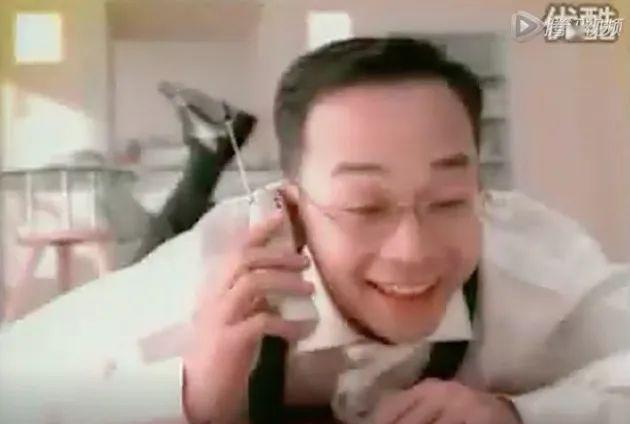
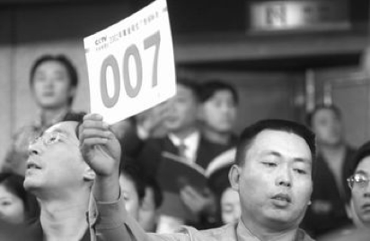

## "段氏门徒"

早在段永平离开中国前，就对步步高进行了改制。他将步步高的三大业务按照人随事走、股权独立、互无从属的原则，成立了三家独立公司，侧重业务分别是黄一禾接管的步步高教育电子、陈明永的步步高视听电子与沈炜的步步高通讯科技。这样的做法，相当于将一手创立的企业全权交给三个部下打理，支持他们创业。

一开始，这三家公司共用步步高的品牌与80%的渠道。没几年，他们就找到了各自专注的领域。陈明永于2002年创立OPPO品牌手机，主打电子通讯产品。2011年，沈炜率领的vivo品牌正式进入智能手机领域。它原本是步步高手机业务的后续品牌，后来为了国际化发展，用vivo取代了步步高的品牌标识。

黄一禾退休后，金志江接班一直在点读机、学习机领域耕耘，专注儿童电子消费市场。他推出的"小天才教育手表"等产品的企业商标中，至今还沿用着"步步高"品牌名。

而远离商界的段永平在低调一段时间后，突然闯入人们的视野。继2003年投资网易获利的新闻之后，他于2006年在eBay上以62.02万美元拍下和巴菲特共进午餐的机会，成为了第一位与股神共进晚餐的华人。

这条消息在中国网民圈炸开了锅，有人说他是为了向巴菲特取经投资，有人说只是为了作秀，更有人诋毁他是赚了中国的钱去美国上层社会装阔气。

对于这件事，段永平认为："我不是把跟巴菲特吃饭这事儿当生意，就是想给他老人家捧个场，告诉世人他的东西确实有价值。不像有些人想的讨个秘方、锦囊妙计，哪天拿出来一看，就能发大财。"值得一提的是，这么重要的饭局，段永平竟然带着一个刚毕业两年的愣头青——黄峥。

2018年7月，黄峥一手创立的拼多多在美国上市，他在采访中提到自己人生最重要的导师和天使投资人都是段永平。考拉看看梳理发现，两人在十几年前就成了"忘年交"。

2002年，黄峥刚从浙江大学竺可桢学院计算机专业毕业，准备去全球排名第8的威斯康星大学麦迪逊分校读硕士。此时，一个叫丁磊的人加他的MSN，说想咨询他一个技术问题。虽然两人互不认识，但很快成了铁杆网友。

黄峥去美国后，丁磊介绍他与浙大校友段永平认识。因为住得近，黄峥会时不时与段永平见面，探讨一些投资话题。2004年，黄峥即将毕业，在微软和谷歌两个工作机会之间，他不知如何选择。与1911年成立的微软相比，1998年成立的谷歌显然太年轻。

段永平告诉他："Google看起来是一家挺牛的公司，值得去看看。对你未来创业也是有好处的。去的话至少呆三年，因为一两年没法真正进入重要的岗位，真正了解这个公司。"

黄峥听取建议，在谷歌工作三年，还参与了谷歌中国办公室的创立。随着谷歌上市，他还拥有了百万身家。期间，段永平带他参加了价值62.02万美元的巴菲特午餐。

2007年，黄峥按计划在谷歌满三年，决定回国创业。段永平当时仍是步步高的董事长，便将其中一块电商业务交予他。不久，黄峥主导的欧酷网上线，由步步高控股，主要出售步步高电子教育产品和OPPO蓝光播放器。

2010年，他卖掉欧酷，成立乐其，帮助淘宝和京东公司开拓市场服务。之后又创建了一家游戏公司，在微信平台上运营。这几次创业经历使他积累了足够的电商经验，为之后拼多多的异军突起奠定了基础。

无论是OPPO、vivo还是拼多多，这三家品牌的背后都有段永平的影子。OPPO如今的营销策略来自当年他营销小霸王时的"明星效应"，vivo早前一直用步步高的商标与销售渠道，拼多多更是在早期就得到了段永平的投资。

虽然他说"黄峥是弟子的说法不合适""从没遥控过OPPO和vivo"，可与此有关的故事却一直流传。即便没有实际指导，但人们相信一个人强大的精神影响足以使他成为灵魂人物。

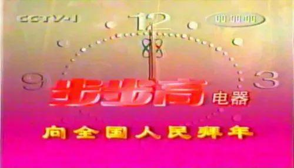
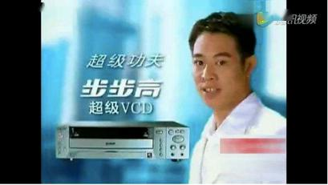

## 成为Nobody

离开步步高转向投资后，段永平又因稳健的手法获利良多。如何管理财富，似乎成为了一项课题。

他觉得人的一生最快乐的是追求财富的过程。因此，夫妇俩一致决定不给孩子留太多的钱财，让他们自己去创造财富。于是两人商议后，决定拿出一部分做慈善。

从这个想法诞生伊始，段永平就开始行动了。2005年，他和妻子刘昕成立了家庭慈善基金，基金的主要慈善方向是教育领域。

他们给美国住址所在的学区提供了一支配比基金。几天后，段永平夫妇在社区内碰见了当时的募捐老师，对方向他们做了一个微小的致谢动作。这个举动让段永平感到很舒心，他说："他的那个表情让你感觉得到他是在说谢谢，但旁边没有任何人知道，你不会觉得很夸张。这就是我希望的那种感觉，you are nobody。"

此后，他又先后在斯坦福设立了两个中国留学生基金。但每次只是管事的人邀请他到教师自助餐厅吃饭聊聊天，送给他一张小小的答谢卡，并没有任何繁琐的致谢仪式。

2006年，段永平回国时曾向媒体表露，投资是他的爱好，而慈善才是他的工作。同年9月21日上午，他和丁磊向浙江大学联合捐赠4000万美元。

2008年9月，段永平夫妻二人又在中国民政部门注册成立了心平公益基金，用于支持国内贫穷地区儿童图书馆的建设。该基金坚持高度透明的运行原则，网站上刊登的信息十分详细，例如"惠普P1007财务用打印机1台：980元"。

2010年2月28日，段永平作为中国人民大学校友、旅美华人企业家，与妻子刘昕一起将所募集的3000万美元捐赠母校，以支持母校事业发展，促进学科建设与人才培养。截至2011年，段永平累计向浙江大学和中国人民大学捐赠4.47亿，在中国大学校友捐赠排行榜中居首位。

段永平认为，公益慈善只是自己到了这个阶段该做的事情。他在接受媒体采访时说："我觉得做慈善没有什么了不起的，我们就是想解决自己的问题，要说什么伟大的贡献、榜样，纯属胡扯。"

他没想过要给谁做榜样，只希望成为一个"Nobody"。

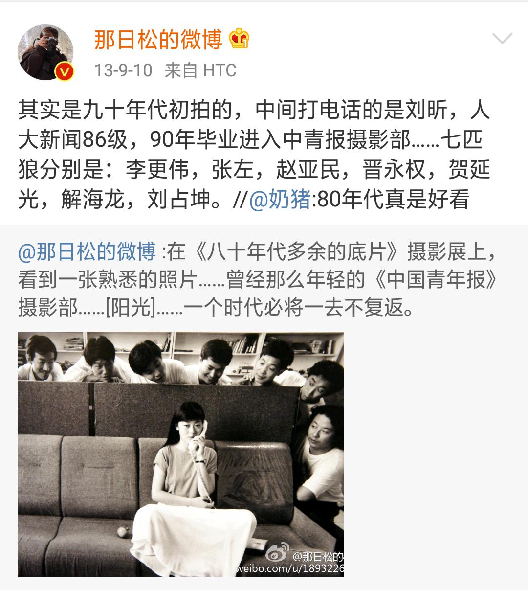
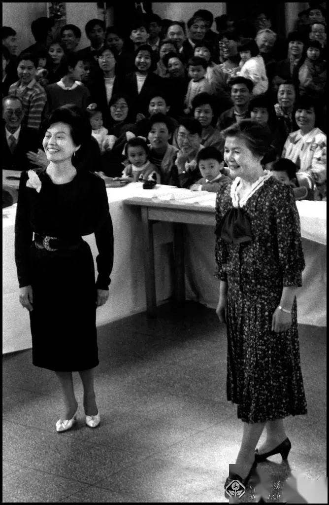
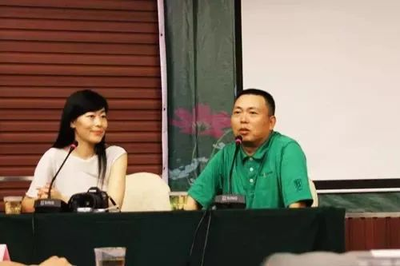
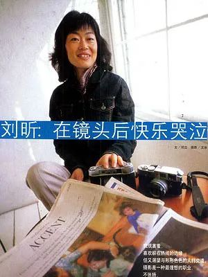
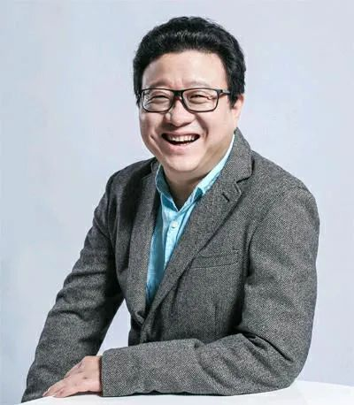
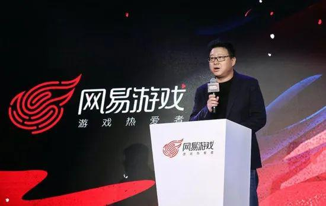
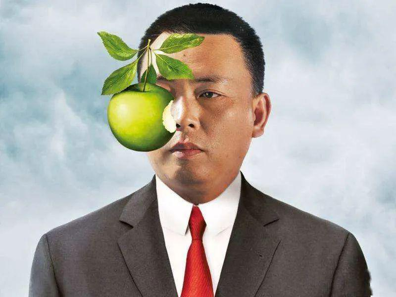
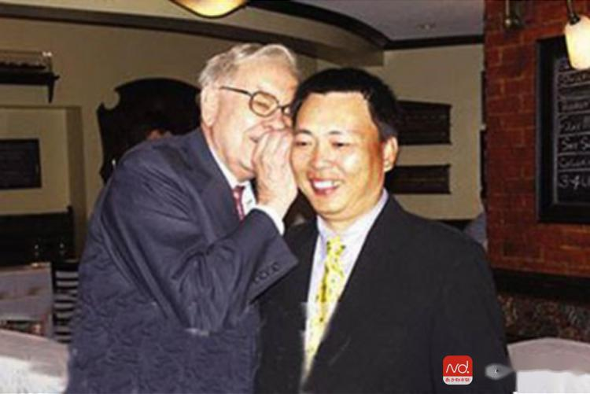
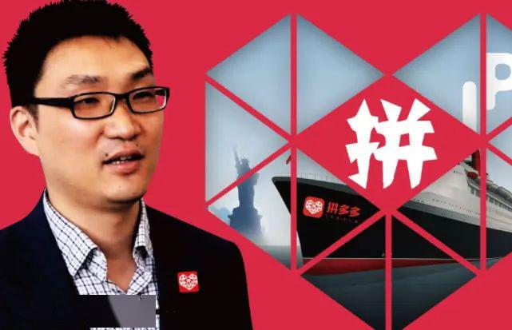
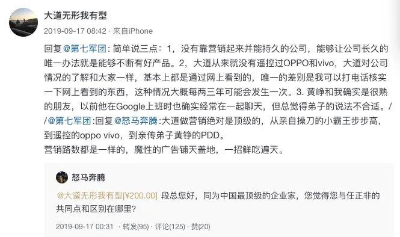
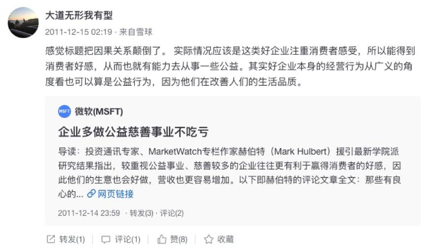
