> 本文转载自 GameRes 游资网，原作者为微信公众号「何加盐」，原文发布于 2020-05-18。
> 原文链接：https://www.gameres.com/867596.html

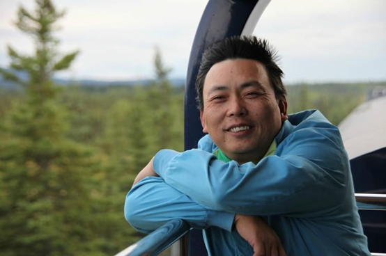

图：段永平

在中国企业家里面，段永平是一个异类。

如果说接手一个十几人的亏损小厂，把它打造成全国知名品牌，很多企业家都能做到的话，那么，放弃“小霸王”，另起炉灶做出“步步高”，并做到如此成功的地步，就不是多少人能做的了。

从90年代后期以来，步步高的若干个产品都做到全国第一，却一直不急着上市，这份克制力也极其罕见。

步步高开枝散叶，直接孵化出OPPO、vivo，间接孵化出一加，这种模式也是全国少有，更别说拼多多也和段永平有着千丝万缕的关系。虽然也有不少其他公司在某些领域有“黄埔军校”之称，但它们大多都是内部人辞职出来创业，而不像步步高这样像有丝分裂一样在母体上孵化出子体，并且很好地把母体的基因传承下去。

细胞的有丝分裂/图源：Wikipedia

而段永平40岁就退休，身为公司董事长，却只顾带小孩、玩投资、做慈善、打高尔夫，一年就回国一两次，电话也不打几个，更是绝无仅有。

他从实业家的角色中退出，又作为投资人，通过投资网易、UHAL、GE等大赚特赚，被称为“段菲特”，这也是前无来者。

由于他的刻意低调，绝大多数普通人，都不知道成龙的“望子成龙小霸王”、李连杰的“世间自有公道”、猥琐男的“喂，小丽啊”、小女孩的“哪里不会点哪里”，都出自段永平的手笔；更不知道小霸王、步步高、OPPO、vivo、一加、拼多多，背后都站着同一个人。

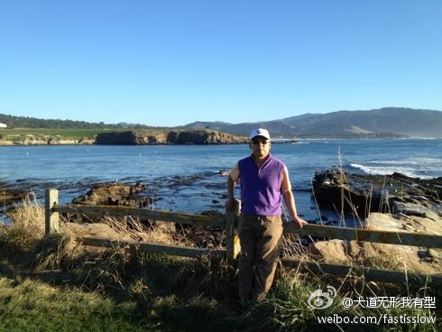

自拍也要搞得很模糊的段永平/图源：段永平微博

段永平，就是一个谜，被一些人称为“中国最神秘富豪”。

今天，我们就一起探索一下，59岁的段永平，背后都有哪些传奇故事。

## 1

1960年，正值三年困难时期，江西泰和人段锡明的日子，和全国人民一样，都不好过。

那时，粮食供应极其紧张，而段锡明的妻子彭建华又怀有身孕，不知道这灾荒何时才能到头。

好在，过完年，生活给了夫妇俩很大的安慰。

1961年3月，他们家新添了一个小男孩，生得虎头虎脑。或许是为了孩子永远平安，或许是为了国家永远太平，他们给孩子取名为：段永平。

也是那一年，段锡明夫妇双双进入了江西水利电力学院（现南昌工程学院）当老师，捧上了稳稳的铁饭碗。

小家庭的日子，终于好过起来。

可是，当小永平在校园里无忧无虑地长到5岁时，事情又发生了变化。

那一年，伟大领袖发出了著名的“五七”指示，段锡明夫妇被下放到农村，接受贫下中农再教育，其后在那里一待就是五六年。

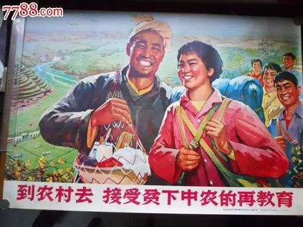

当时的宣传画/图源:7788.com

年幼的段永平，也跟着父母下乡，在井冈山下度过了自己的小学时光。

当时的条件非常艰苦。段永平上的小学是混合班，1-3年级合并上课，教室极其破旧。除了语文数学外，学校还教“赤医课”、“农机课”、“气象课”等。

小小的段永平也要跟着大人插秧、割稻子，忙得没日没夜。但有时候也很快乐，例如和小伙伴一起到河里抓鱼，每次抓到一条鱼，是最开心的时候。

就这样有苦有甜地过完童年，段永平成了一个顽皮孩子，用小石头打鸟，打人家的鸽子、玻璃窗的事儿没少干，练就了百发百中的本事。他虽然个子不高，却长得很壮实，在军事训练中，扔手榴弹能扔60多米。

当然，最重要的还是抓革命思想。段永平成为“学毛选积极分子”，心中记得最牢的一句话是：井冈山道路通天下，毛泽东思想照全球。

但是，对段永平以及当时的中国青年而言，如何才能“通天下”，却是谁也不知道。连整个国家都处于迷茫之中，何况这些十几岁的孩子呢。

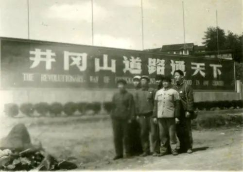

那个年代的照片

1977年，一代人迎来了人生的重要转机，那年10月，国家宣布恢复高考。

段永平的生命里燃起了曙光。虽然在刚上小学时就赶上了文革，可谓“最不幸的一代人”；但高中毕业时刚好赶上恢复高考，又可谓当时“最幸运的一代人”。

考上大学，成为段永平的全部目标。

1977年11月，16岁的段永平与570万考生一起，参加了这个国家已经久违多年的高考。

可惜的是，在干农活、摸鱼虾、学毛选和调皮捣蛋中度过青少年时光的段永平，成绩一塌糊涂，4门科目加起来，才80多分。

从燃起希望到希望破灭，前后也就两个月。

但段永平没有痛苦多久，他很快又投入了新的奋斗。考上大学，是他此时唯一的人生目标，不管前路多少困难，都阻挡不了他改变命运的决心。

他开始没日没夜地投入学习。虽然学习非常艰苦，非常累，但这种朝着目标前进的感觉，却让他体会到前所未有的充实与快乐。

1978年7月，段永平再次走进考场。

这次，他的成绩，仍然是80多分。

不同的是，这次“80多分”，是每门的平均成绩。这一年考试是考5门，段永平总分达到400多。

段永平成为他们学校唯一一个考上本科的学生。而且考的还不是一般的本科，而是：浙江大学！

这段高考经历，成为他一生中最难忘的时光，也给他建立了强大的自信：我只要认准了想做一件事情，就一定能够成功。

1978年9月，段永平来到杭州老和山下，进入浙江大学无线电专业学习。

那一年，他17岁。

## 2

刚进大学的段永平，完全是一个土包子。

当时，他奉母命，来杭州拜访舅舅，要给舅舅打一个电话。可是，来到打电话的地方，研究了十几分钟，就是不知道电话该怎么用。

后来，还是通过观察别人是怎么打的，他才学会。

谁也想不到，这个第一次和电话打交道，就遭遇如此尴尬的人，日后将成为中国无绳电话大王，以及OPPO和vivo两大畅销手机背后的男人。

一般人都是在高中时过得痛苦，到了大学就放飞了自我。而段永平则刚好相反。

高考时，他知道自己要考大学，每天给自己安排得很充实，然后一天天接近目标，这个过程让他很快乐。而大学时，他失去了人生目标，不知道干什么好。

若干年后他回忆道：

我人生中最不能忘怀的第一个经验就是高考。……那时候上大学的概念是什么？是一切。所有的人生目标都浓缩到这里，我段永平恨不得用一切聪明智慧和时间来换取这张入场券！

可连我自己都难以想象的是，当接到大学录取通知书的刹那，我的内心却突然变得非常平静，甚至有一种从未经历过的迷茫。我觉得桃子变味了。我是在瞬间悟到了‘人生的乐趣在于它的过程’这一道理的……

（见《段永平：本色英雄》，原载《赢周刊》，记者陈红云）

当时很多人的梦想都是当科学家，但段永平环顾周边，看到比他牛的同学多的是，不想往科学家的道路上挤。而中国的商品经济也还没有开始大发展，所以段永平也不知道未来还能干嘛。

1982年，段永平大学毕业，被分到北京电子管厂，月工资46元。与他同一年分到这里的，还有来自杭州电子工学院一位叫王东升的人。

北京电子管厂是国有企业，段永平能进来，等于拥有了当初父母梦寐以求的铁饭碗。但是，与父母在一个单位一干就是三十年不同，段永平干了3年，就觉得厌倦了。

他考取了中国人民大学计量经济学研究生，跳出了国企。

和他同年进来的王东升则继续留在这里工作，在苦熬10年后，受命接管濒临倒闭的电子管厂，并将其改制为京东方，日后创造了京东方的“光变传奇”。此是后话。

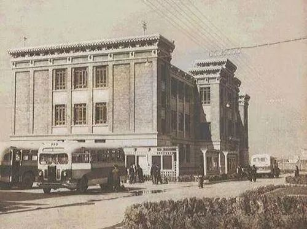

北京电子管厂老照片

段永平在人大就读期间，有了第一次商业尝试——贩卖章光101生发剂。尽管没有赚到多少钱，但是做生意的过程却激发了他浓厚的从商兴趣。只不过，他不大喜欢这种倒买倒卖的方式。他心里想的是：如果我自己有一家企业，那该多好啊！

那几年，最令他痛心的，是父亲于1987年在北京病逝。段永平年少时，因为家贫，父亲还要向邻里借钱供他读书。而现在，自己尚未立业，父亲就撒手人寰，给段永平留下终身的遗憾。很多年以后，段永平以父亲的名义，在南昌工程学院捐建了一座图书馆。

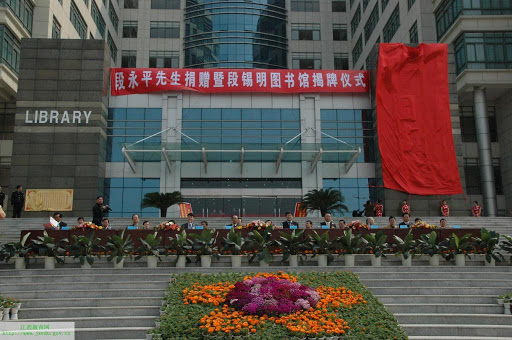

南昌工程学院段锡明图书馆/图源：江西教育网

硕士毕业前，段永平本来有机会留在北京，有几家很不错的单位都愿意招录他。但是，他发现这些单位的官本位思想都特别强，夸奖单位有多好，都是说：你看，谁谁谁（某大领导）的儿子都在这儿。

段永平想，我就是平头百姓的儿子，在这种单位，感觉很不自然，还是算了。于是就没去，转头到了天高皇帝远的南方。

后来有人说，段永平真傻，北京户口值一万多块钱呢，就这么不要了，多可惜。段永平笑笑说，这有什么可惜的，以后如果想要，我再花一万多块钱买回去不就完了。

他决定到离商业最近的地方去——当时， 他连硕士论文都还没交，所以后来连硕士学位证都没拿到。他的最高学历，一直就是浙江大学本科。

那个年代，最火热的地方，一是海南，二是广东。他先到海南跑了一圈，觉得氛围太狂热，看着不大靠谱，于是就到了广东珠三角。

到广东之初，他先是进了一家看起来欣欣向荣的公司。这家公司有几百名员工，老板的目光很大，1988年一年，就新招了150多个本科生，50多个研究生，高学历人才密度比北京很多科研单位都高。但段永平感觉老板虽然招了这么多高学历人才，用起来却不大尊重，而且自己在这里很难发挥所长，所以很快就离开了。

经同学介绍，他进了中山市怡华集团下属的一个小工厂。

这家名叫“日华电子”的小工厂，生产家用电视游戏机，由于经营不善，一年亏损200多万。段永平加入的时候，总共只有十几条枪，账上共计3000多元资金。

以段永平当时浙大无线电本科毕业、在人大读过经济学研究生，又在北京电子管厂干过的资历，在日华电子简直光芒万丈，加上段永平本身能力就很强，怡华集团的老总陈健仁很快就慧眼识英，让他担任了日华电子厂的厂长。

那一年，段永平28岁。

## 3

日华电子的主业，是组装生产当时刚刚开始在中国火爆起来的家庭游戏机，就是由日本任天堂公司首创的那种可以连接在电视机上的红白机——这种游戏机，应该是很多七零后和八零后心中美好的回忆。

刚开始，段永平采取了租用品牌的方式，租了台湾一个游戏机牌子，名叫“创造者”。由于段永平的产品很好，创造者卖得很火。但是后来他发现，创造者品牌的持有人及其香港代理人，在日华已经租下牌子使用权的情况下，偷偷地把牌子同时给别人用。

段永平一怒之下停止了和创造者的合作，决定自创品牌，最后选定了“小霸王”这个名字。

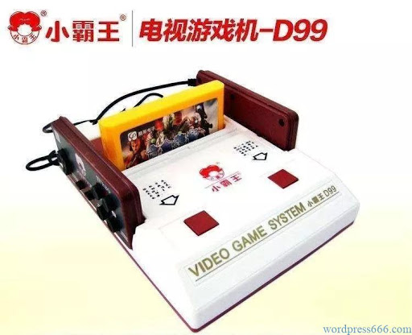

小霸王游戏机

“小霸王”是同事在吃饭的时候偶尔提出来的，段永平一听就很喜欢。因为他觉得，小霸王这三个字很响亮，而且绝对不会引起歧义，你永远不需要向别人解释是哪个小字、哪个霸字、哪个王字。

1991年段永平用40万元，在中央电视台打了一个广告。这是此类产品第一个在中央台打广告，让小霸王一下子具有了全国知名度。加上段永平的管理也很有一套，小霸王产品过硬，服务周到，很快迎来了一个急速发展的时期。

1992年，尝到甜头的段永平又在央视砸了200万元人民币。在强力广告的撬动下，当年小霸王实现1个亿人民币的产值，纯利润超过800万元，此时距离段永平接收日华厂才三年时间。也就是这一年，日华电子厂更名为“中山市小霸王电子工业公司”。

在段永平的主持下，一批精英人才，也纷纷来到中山这个小地方，加入小霸王公司。其中包括：后来创立读书郎的秦曙光、与杜国楹一起搞出好记星的张雨南、创立金正的杨明贵，以及后来被称为他的“弟子”或“门徒”的步步高CEO金志江、OPPO掌门人陈明永、vivo掌门人沈炜等。

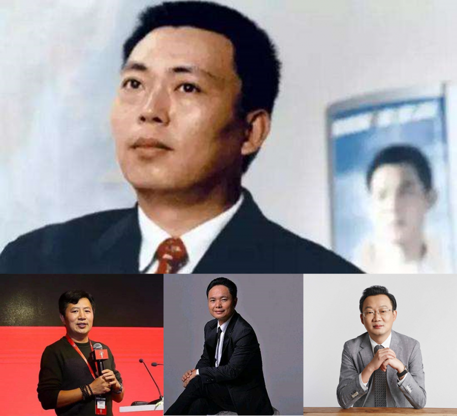

上：段永平；下从左至右：金志江、陈明永、沈炜

段永平在公司管理中，坚持“本分”的价值观。这个词被他延伸出很多含义，包括讲诚信、不占人便宜、有自知之明、秉持平常心等等。总体而言，就是做该做的事，赚该赚的钱。这也意味着不对的事情坚决不做，不该赚的钱坚决不赚。

日后，这将成为段永平说得最多的词，也将是深入到步步高、OPPO、vivo以及拼多多等公司文化基因里的最重要的东西。

1993年，小霸王研制出了电脑学习机，这款学习机以家用电视机作为显示屏，拥有计算机键盘、电脑学习卡、以及游戏机等功能。由于当时电脑昂贵无比，普通人几乎没有机会学习电脑，小霸王学习机提出了一个简易的替代方案。

更为厉害的是，段永平先后制作了“你拍一，我拍一，小霸王出了学习机……你拍四，我拍四，包你三天会打字”和成龙的“同是天下父母心，望子成龙小霸王”的广告，在央视黄金时段播出，让小霸王学习机一下子火变全国。

好产品、好广告、好团队、好制度，加上诚信经营，这样的企业，想不红火都难。

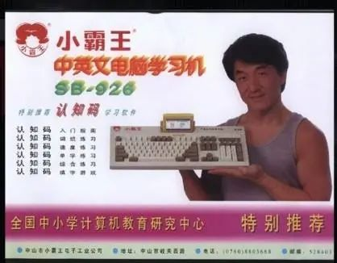

成龙代言的小霸王电脑学习机

1994年，小霸王产值达到4个亿，市场占有率成为同类产品绝对第一，甚至在某次关于电脑品牌的市场调查中，令人啼笑皆非地被消费者选为国人最熟悉的电脑品牌。

按照段永平当厂长时和集团老总的约定，日华厂由段永平全权负责，所获利润80%上交集团，20%由段永平分配。但随着小霸王的业绩越来越好，当集团其他业务板块需要资金时，总是从小霸王这里抽调；原来二八分账的约定，也总是无法兑现。

1995年，小霸王继续高歌猛进。段永平觉得按照原有体制再发展下去，他无法实现对高管和员工的承诺，希望将小霸王改为股份制。

在当时，体制改革是很敏感的一件事情，而怡华集团是集体企业，集团老总陈健仁也决定不了改制的事情，地方政府也不敢贸然拍板。

段永平觉得，如此下去，5年、10年，公司肯定会因为组织架构和激励机制先天缺陷的制约而做不下去。既然如此，那我现在待在这里也没有任何意义。

但是，如果要离开，代价也是非常巨大。

首先，按照当时小霸王的业绩，如果待下去，段永平年收入上千万是没有问题的。在90年代中期，这可是一笔巨款，可能是职业经理人中最顶级的收入了。如果要离开，这笔收入就没有了。

其次，段永平当初作为一个穷学生，进入工厂的时候，口袋里只剩最后五块钱，是陈健仁老板看中了他，把他提拔为厂长，并且授予了充分的权力，可谓有知遇之恩。要离开的话，这是一笔巨大的人情债。

但段永平还是决定离开。他认为：

“钱对我来说并不重要，（继续在这里做）违背了我本分的东西，然后我觉得我不快乐，我不快乐你给我多少钱我依然是不快乐。”（见《财富人生——段永平》，第一财经《财富人生》，主持人叶蓉）

他的理念一以贯之：一个人首先是要做对的事，不对的事情不能做。现在既然这件事情不对，那就要果断停止。哪怕需要付出巨大的代价，从长远看也是最小的代价。

于是，段永平和陈健仁开诚布公地谈了。陈健仁很想留住他，但也知道，段永平的那些要求，他没有办法答应，只好无奈地放手。不过，当时他们留下了君子之约。

约定的内容大体如下（根据段永平访谈和演讲时的回忆还原，在不损原意的情况下略有改动）：

陈健仁：你肯定还想开公司？

段永平：是有这个想法。

陈健仁：你是不是还想带一些人走？

段永平：如果可以的话（就带）。

陈健仁：你想带多少人？

段永平：大概有十来个人也都行了。

陈健仁：能不能只带六个人？

段永平：好的，那就六个人吧。

段永平：我在一段时间之内，不会在国内竞争小霸王同类产品的市场，一年够不够？

陈健仁：一年足够了。

段永平：好的，那就一年吧。

（谈人部分见《财富人生——段永平》，第一财经《财富人生》，主持人叶蓉；承诺避开竞争部分见《段永平先生在央视“品牌与传播国际论坛”上的演讲》）

于是，1995年8月，集团正式宣布了段永平离职的消息。段永平只用了15分钟，就交接好了工作——此前他的大胆放权，让自己这个厂长其实并不负担多少日常管理事务，所以都没什么好交接的。

陈健仁专门送给段永平一辆奔驰车，作为告别礼，并为他举行了盛大的欢送仪式。

酒会“动情而悲壮”，很多人都哭了。段永平后来说，“只觉千杯酒少，只想一醉方休。”想必他的心里，也是五味杂陈。

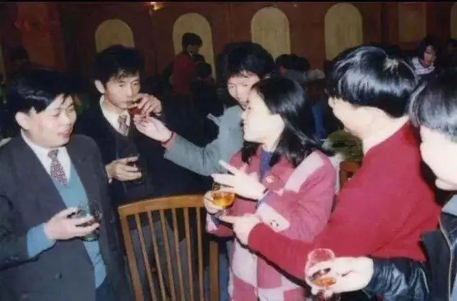

小霸王时期的段永平/图源：出小霸王记，公众号鹿鸣财经，作者陈兰

一个月后，他在距离小霸王直线距离30公里的东莞长安成立了力高电子。

那一年，段永平34岁。

## 4

就段永平的本心而言，他并没有“非创业不可”的想法。其实，那时他主要心思放在追女朋友上面。由于他心仪的女孩在美国留学，他也很想到美国去读书。

但是，兄弟们不甘心。他们总觉得，凭这个团队的能力，出去干别的事情，一样能成功，所以还想再证明一次。

段永平不想辜负兄弟们的期望，就说，那就干吧！

听到段永平要另起炉灶的消息，原来的高管、供应商、经销商纷纷找上门来，有的要加入公司，有的要投资入股，有的要代理产品——所有人都知道，段永平做生意恪守本分，一定不会亏待别人。

于是，段永平很快就有了一支实力强悍的队伍，有了足够的资金，也有了现成的销售渠道——哪怕当时他的产品连八字都还没有一撇。

起初，段永平在新公司占有70%的股份，但他这个股份不是为自己而拿，而是为后面的人才和投资者代持，几年以后慢慢稀释到了10%左右。

由于段永平答应陈健仁第一年不在国内竞争，所以这一年也没太多事可做，只是派人出去俄罗斯等地搞外销，自己则每天优哉游哉地打高尔夫。

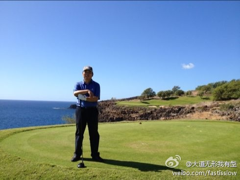

打高尔夫的段永平/图源：段永平微博

他让人去做外销，其实也没指望能挣多少钱，主要是不想让大家闲下来，起码让工厂能开工，销售有业绩。实际上，外销的收入，也只是够公司的皮费而已，总体上还是亏钱的。

这段时间最重要的一件事情，就是为公司起一个新的品牌名字。这回，他采用了全国征名的方式，承诺一经采用，奖励5000元，一下子征集到一万多个提案。

那时候，给公司起一个看起来像是外国的名字，非常流行，很多人也建议段永平这样做，但段永平毫不犹豫地拒绝了。他认为这不符合本分，因为你不是外国产品，却起一个外国名，本意就是想让消费者误以为是外国产品，是一种欺骗。

最终，他选出来的名字是：步步高。

这个名字和小霸王一样，朗朗上口，绝不需要向别人解释是哪三个字，寓意也非常好。

但让段永平头痛的是，提议用“步步高”这个名字的，总共有8个人，原来承诺了奖励5千元，这下子翻了8倍。不过，尽管大大超支，段永平还是决定照付，所以这个名字实际上花了4万元的起名费（这还不算征集的成本）。

到1996年底，段永平和陈健仁约定的一年早已过去，大展拳脚的时间到了。

他参与了中央电视台的投标，最终以8123万4567元8毛9分的价格，抢下了《天气预报》之后的一个广告位。

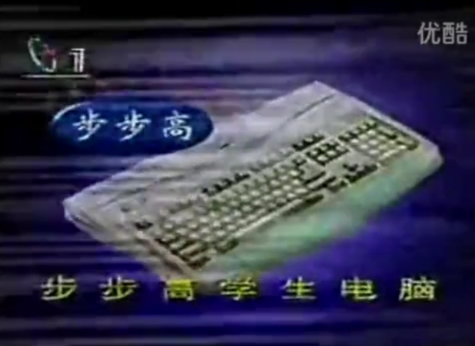

1997年央视广告/图源：B站@电脑学习机考古

这8千多万元，是步步高公司几乎所有家产。当时，由于俄罗斯外销回款不及时，步步高欠供应商的款都无法如期交付，这种情况下要拿出8千万来打广告，需要极大的勇气。最难的时候，俄罗斯那边结汇需要漫长的程序，而这边供应商等着付款，那边央视催着付广告费，公司的账上，只剩两万块钱。

最后没有办法，段永平决定铤而走险，让俄罗斯的同事用两个大旅行袋直接扛着将近2千万美元，坐飞机从莫斯科经由香港带回来——若干年后，段永平依然对这件事心有余悸，因为那些黑帮分子常常为了抢一箱美金都拿枪射来射去，何况是两个大旅行袋的美金。

这个广告的效果非常大。因为当时步步高重新启动，段永平感觉很难跟供应商、客户、员工解释“我们又重新开始了”，他怎么说大家都感觉还没开始。而央视广告打出来后，“是一个非常强烈的信号，每一个神经末梢都能感觉得到。我们的客户、我们的基础员工，甚至包括我们的基层客户，大家都知道我们这个公司要启动了！”

1997年，步步高进入了VCD市场。当时，这个市场已经有200多家厂商在惨烈厮杀，爱多、先科、万利达等品牌也已经占据市场领先位置。但段永平从来都不怕跟在别人后面进入市场，他的理念是“敢为天下后”——这也是对自己和团队能力的极度自信。

在一众先行者中，爱多最为生猛。其创始人胡志标，在27岁那年，用公司全部利润450万元，请成龙拍了一条“爱多VCD，好功夫”的广告片，然后又多方集资了八千多万元，拿下了中央电视台的1997年广告标王。

经过央视黄金位置的推广和成龙的广告效应，爱多VCD一时家喻户晓，到步步高进入这个市场时，爱多已经年产值十几亿元。

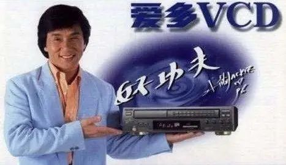

成龙爱多VCD广告

此时，小霸王的核心团队，有一大半都陆续跟着段永平到步步高了（虽然他走的时候只带了六个人，但后来不断有其他人自动来投奔），经销商也全都愿意与步步高合作。所以，步步高卖VCD，从产品研发、生产到经销渠道，是完全没问题的，唯一的问题就是如何让用户知道。

段永平用了非常取巧的一招，由于爱多已经签下了成龙，他就找了李连杰，拍下了“步步高，真功夫”的广告，一时之间爱多“好功夫” VS 步步高“真功夫”成为街谈巷议的热门话题，“世间自有公道，付出终有回报”的广告歌，也走进了千家万户。

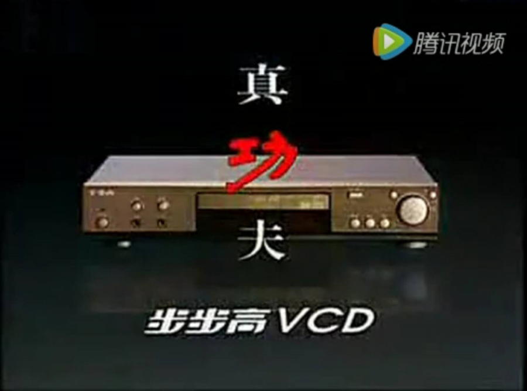

央视李连杰版步步高真功夫广告片尾

尽管爱多继续以2.1亿的价格拿下了1998年央视广告标王，但步步高凭借广告上搭便车，也跟着一飞冲天，迅速进入VCD厂商前三之列。

1999年，爱多因内部股权纠纷及其他矛盾，陷入严重危机，公司很快走向失败。

而步步高这边，于1999年和2000年连续两年成为央视标王，并邀请了国际巨星施瓦辛格来拍广告，坐稳了市场第一的宝座。

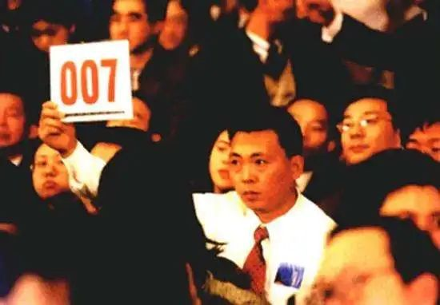

段永平在央视投标

与施瓦辛格的合作还经历了一场波折。步步高为拿下施瓦辛格在中国的形象使用权，花费了250万美元的巨资（当时约合2千万人民币），分两次付清。本来步步高和央视签的合同是把这个广告连播两年，但没想到播出后不久，央视就接到大量投诉，说中央电视台的黄金时段，怎么能老放外国人的广告云云。

这种投诉在我们今天看来不可理喻，但在当时却具有政治含义，央视在压力之下，只用了两个 月就把广告撤下了。而步步高的营销本来都是围绕这个主要投放渠道的宣传效果而制定的，所以一下子措手不及，计划全都打乱，遭受了很大的损失。

与施瓦辛格那边，本来是谈好的用两年，现在只用了两个月，所以步步高考虑，第一笔已经付清的125万美元就算了，第二笔能不能免掉。施瓦辛格团队先是不同意，后来步步高这边的谈判人员很强硬，对方也没招，就同意少付一点，免掉了40多万美元。

当所有合同做好，就等着段永平签字时，段永平犹豫了。他和大伙讲，这件事我们是不是做得不本分？对方也没有做错任何事情，不应该承担这个损失。于是最终，他没有签字，决定按原合同执行，把剩余的125万美元如数打过去。

施瓦辛格的律师听到这个消息时都惊呆了，连问了几声“说什么？你再说一遍”？

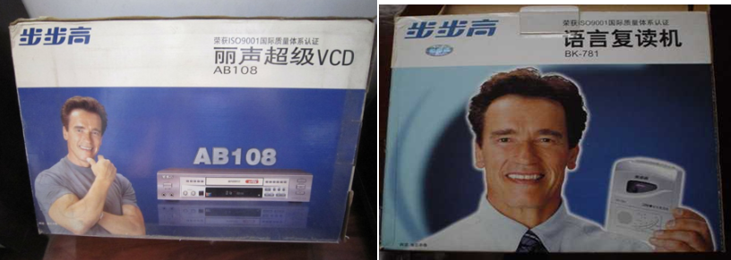

施瓦辛格代言步步高产品

步步高接连用天价邀请巨星拍广告，并两夺央视标王，当时也引起不少非议。

有人质疑花那么多钱请巨星、上央视是不是值得。段永平认为非常值。因为巨星的名气和形象、央视的影响力，是帮助品牌快速打造知名度和美誉度的最好方式。他说：

“当年在小霸王，用成龙，有些人看三次就记住了。如果没有成龙，可能要看九次十次。我算过一个帐，我们付给成龙的钱，只有我们广告投放额的百分之几，连百分之十都不到，为什么说他便宜呢？只要他能够提高百分之几的传播度，那就是赚的。”（见《财富人生——段永平》，第一财经《财富人生》，主持人叶蓉）

“我们企业每年都投广告，一般都选择黄金时段，黄金时段的价格肯定最贵，但往往价格最贵的实际上是最便宜的，最便宜的广告也许是最贵的。”（见《段永平先生在央视“品牌与传播国际论坛”上的演讲》）

也有很多人质疑说，段永平就是打广告厉害，小霸王和步步高都是广告打起来的。段永平则认为：

“广吿只是在企业市场营销当中的一个环节而已。大家千万不要以为有了广告就有了一切。一个企业要做好，有很多因素，包括从企业的核心价值观、企业的系统、战略、到领导风格，人力资源、核心竞争力等等各方面。广告只是你的经营技巧中的一个环节而已，如果太注重广告，不注意其他方面，企业往往是很难做好的。”（见《段永平先生在央视“品牌与传播国际论坛”上的演讲》）

“产品进入市场一定不是靠广告，而一定是靠产品。”（见《深度采访段永平：本分为王 》，《厂长经理日报》2001年11月刊，记者沈青）

今天我们回过头来看，这番话说得何其有道理。在步步高之前的其他标王，孔府宴酒、秦池、爱多，广告做得并不比步步高差，但全都倒了。所以，说步步高起家是靠广告，固然有部分道理，但也肯定忽略了另一部分至少同样重要的因素。

步步高的快速崛起，除了激励机制、团队能力、企业文化等原因外，最重要的就是产品和广告两个拳头都够硬。

像段永平一样能做好产品的企业家，并不是没有，但是这些人都没有他那么会吆喝。

而像段永平一样很会吆喝的企业家，也有很多，但是这些人又没有他那么会做产品。

做好产品是必要的，吆喝也是必要的，缺哪一个都不行，只有这两者都做好了，公司才能发展好。

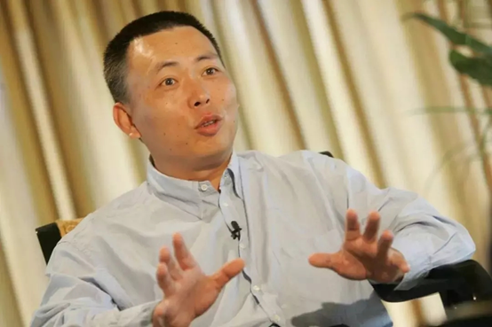

段永平参加第一财经《会见财经界》，主持人秦朔

当然，段永平也不是做什么都能成功，甚至可以说，成功的路上也是充满血泪。

1996年，由于要坚守承诺不能做内贸，于是全力开拓俄罗斯市场，结果差点全军覆没，后来好不容易走出危机，却已经把公司的资产赔掉了三分之一。

后来，步步高看到市场上一种电子小鸡卖得很红火，便也切入进去。市场上卖50多元的产品，步步高的成本价只有十几元，于是很多经销商都大量进货。

但后来，段永平发现消费者兴趣转移很快，产品渐渐滞销，而在生产端，也出现了问题。

当时，生产电子小鸡的工厂出现了产品丢失现象，工厂管理人员采取了当时业内通行的管理办法：对员工搜身。

段永平听到这种做法后，心里特别不是滋味，马上叫停了。他认为，一家本分的公司，绝对不可以用这种方式和自己的员工打交道。但是，一时又找不到好的管理方法，正好碰到销售上也在下滑，于是就果断把这个项目叫停了。

产品停掉后，为了不让经销商吃亏，段永平把已经铺出去的货全部收回，前后损失了一千八百多万元。

后来，在千禧年到来之际，段永平在对全公司以《21世纪来了》为题发表跨世纪讲话时，专门提到这件事情，并且说：

“如果我们真的无法找到能够管理这类产品的办法，我宁愿放弃这个产品也不可破坏我们的原则！我真诚希望下个世纪不会再有类似的事情发生。”

1999年，步步高的三大品类：影音产品（VCD、DVD、家庭影院）、通讯产品（无绳电话、普通电话）和学习机（学习游戏机、复读机），都已经做到了市场第一或者前三的位置。

仅仅用了3年时间（连第一年啥事不做的时间也算在里面），段永平就从零开始，把一家公司在多个领域做到巅峰，这不得不说是一个奇迹。

随后，他把步步高一拆为三，由黄一禾负责教育电子业务（后来由金志江接任），陈明永负责视听电子业务，沈炜负责通讯科技业务。分拆的三家公司，段永平各占10%的股份。

后来，金志江、陈明永、沈炜，加上拼多多的黄峥，被称为段永平的“四大门徒”。

待续......

来源：微信公众号“何加盐”

原地址：https://mp.weixin.qq.com/s/rA8y2Kgn2_Ygv16CP00SXg

** 收藏 ** 评论

## 评论
侧栏打开
[登录](/login?next=%2F867596.html) 后参与讨论

暂无评论，来抢沙发

##
