> 本文转载自 GameRes 游资网，原作者为微信公众号「何加盐」，原文发布于 2020-05-19。
> 原文链接：https://www.gameres.com/867708.html

接上篇：[闲人段永平（上）](https://www.gameres.com/867596.html)

## 5

2001年，在事业如日中天的时候，段永平突然宣布退休，跑到美国过隐居生活去了。

之所以跑到美国，也是为了兑现一个承诺——对爱情的承诺。

1995年从小霸王离开时，当时段永平最想做的事情，是去美国留学，因为他要追一个叫刘昕的女孩。只是为了对弟兄们的承诺，他留下来做了步步高。

刘昕是西安人，比段永平小7岁。当年段永平在人大读研二时，18岁的刘昕也进入人大新闻学院读书，所以刘昕算是段永平的学妹。

大学毕业后，她在中国青年报工作一段时间，然后赴美国俄亥俄州大学留学，这也是为什么1995年段永平想去美国留学的背景。

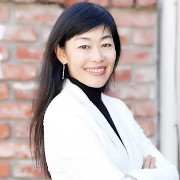

段永平妻子刘昕/图源：Stanford PACS

段永平追刘昕追了很久，1997年她去荷兰参加“荷塞大师班”时，段永平还曾追到荷兰去。

1998年，在美国当摄影记者的刘昕回国探亲，顺便和段永平领了证。但这次领证有一个条件：段永平以后必须去美国生活。

段永平一口答应。当时其实步步高正在快速发展期，段永平还放不下公司，但是他存在一点侥幸心理，觉得去美国就要办绿卡，而绿卡办下来还不知道要猴年马月呢。

但是很快，随着刘昕怀孕，段永平不得不考虑更多照顾家庭的问题。也许把步步高拆分，自己从具体的管理中脱身出来，也有这方面的考虑。

1999年，他们的儿子出生。段永平把空闲时间都放在陪老婆孩子上面。每到周末，如果有人想和他谈生意，打电话约见面，段永平就说不行，要陪小孩。

对方感觉很诧异，觉得我是和你谈生意啊，你怎么可以因为这个事情而拒绝我呢？

“做生意比陪家人更重要”，这种心思，恐怕是国内大部分做生意的人都有的。但段永平就认为应该陪家人比做生意更重要。

所以每次面对别人这样的疑问，他都不知道怎么回答好。他知道别人会腹诽“在你心目中，你儿子比我重要”，但他认为：废话，我儿子当然比你重要了。

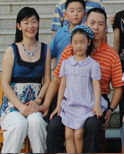

段永平一家四口/图源：南昌工程学院官网

2001年，完全出乎段永平意料的是，他的绿卡居然很顺利就办下来了。

尽管段永平并没有做好准备，但是却不想违背对刘昕的承诺，于是，他很快安排好公司的事宜，在40岁那年，就抛下公司跑到了美国，在加州的帕罗奥托住下来。

对于这么大的事业，说放下就放下，我不知道除了段永平以外，国内还有哪个企业家这样做过。

而段永平去了美国，也不像其他去美国学习或定居的企业家一样，还远程遥控着公司。相反，他一年到头连电话也不打几个，回国也就两三次，而且几乎不谈公司业务，回来就不停地唠叨本分、本分、本分，然后就是打高尔夫球，干别的。

OPPO的CEO陈明永在接受《创业家》记者和阳采访时，曾把对段永平这种闲云野鹤的“幽怨”展示得淋漓尽致：

和阳：你迷茫的时候会跟阿段聊？

陈明永：你不要想着阿段在我身边。风投起码每个月或者每个季度来看一下，他连这个都没做到嘛。

和阳：阿段回国的时候总是要聊一下？

陈明永：他都没有回国啊，等到他回国的时候我们都已经做好了。他一年大概回国两三次，加起来时间不超过一个月。他回来之后，我们会一起聊聊天啊，打打球啊，可是仅限于娱乐。阿段说过的话很多，其中一句话是：这个事情交给你们干，你们就好好干；如果做不好，你们就干好一件事，就是把这个企业好好地关悼；不要指望我再做什么，因为这是你们的事情。（见《OPPO：赢在那儿——创业家专访陈明永》，《创业家》2013年，记者和阳）

不管公司的事情以后，段永平除了陪老婆孩子，其他时间就闲了下来，在美国也不知道干嘛好。

前面说过，段永平是个必须有目标的人，如果没有目标，他就会万分痛苦。于是，他想，我总得找点事儿干。

想来想去，想出了一件：炒股！

在此之前，他都是埋首于实业，从来都没有碰过股票，也丝毫不关心。但是到美国后，就开始看关于投资的书。

后来，他看到了巴菲特的书，一下子仿佛打开了世界的另一扇天窗，窥到了一个从未见识过的玄奥之境，从此成为“价值投资”理念的终身拥趸。

## 6

段永平的第一次大手笔，是购买网易的股票。

他到美国的时候，正是网易最艰难的时光。当时正值互联网泡沫破裂之后，网易经历了一系列打击，还处于一个很不利的官司之中，股价由上市时的3.03美元和高峰时的9.38美元，一路狂跌至0.64美元且一度被停牌，甚至面临摘牌的风险。

段永平仔细研究了网易的财务报表，看到网易每股现金流还有两块多；又花大价钱请了专业律师，分析出网易被摘牌的可能性很小；然后又从与丁磊的聊天中，知道了网易未来在游戏产业的雄心——而恰好，他自己就是一个喜欢打游戏，而且是从做游戏机起家，深谙游戏市场巨大潜力的人。

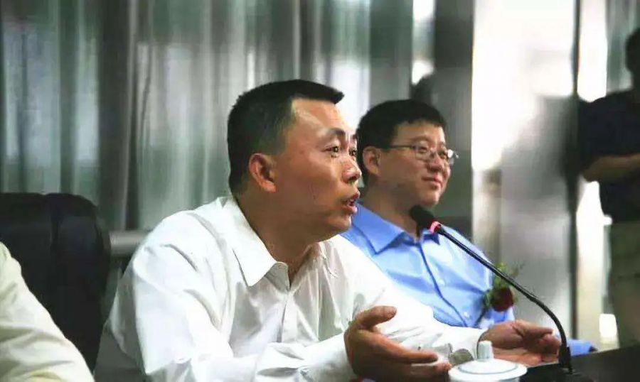

段永平和丁磊

他认为网易的价值被大大低估，以后有大涨的机会，于是，把手头能动用的两百多万美元全部投进来，以0.8美元左右的股价大量吃进，成为了网易第二大个人股东。

第二年，网易躲过了摘牌的风险，且其推出的网络游戏《大话西游2》大获成功，股价开始起死回生，到2003年10月，已经涨到70美元。

也就是说，仅仅用了一年多时间，段永平投入的两百多万美元，已经变成了一亿多美元。

这一年，丁磊成为“胡润百富榜”的中国首富，段永平也进入到第83名。

实际上，如果按照实际财富，段永平可能在2001年和2002年就有资格进百富榜，胡润也曾经想把他列入，只是段永平想保持低调，说胡润的资料不准确。

由于步步高不是上市公司，而且公司从不对外公布财务数据，所以胡润也没有办法，只好把段永平列在第101位，实际上是表明他是“隐形富豪”的第一人。

而2003年，由于段永平持有的网易股票超过5%，根据美国证监会要求，必须予以报备，而且会在证监会网站公布。所以这回，段永平也没法藏富，就被胡润按照其持有的网易股票估算，将他以10亿元的财富列入第83名。

但对段永平来说，被列入百富榜反而成了他的负担，让他无法再保持低调。所以从那以后，他买股票尽量不超过5%，避免要公开报备。

后来，段永平又以3.5美元的价格买进拖车租赁公司UHAL的股票，日后涨到了100美元以上；购买美国电气巨头GE的股票，也赚了上亿美元；在中国内地和香港市场，他也通过购买万科、创维、茅台等，获利颇丰。

2006年，段永平以62万美元的价格，拍得了巴菲特慈善午餐。这一举动让段永平想低调都不可得，成为被舆论热议的人物，其影响一直到14年后的今天，仍然热力不减。每年巴菲特午餐拍卖的时候，段永平就要被拿出来说一番。

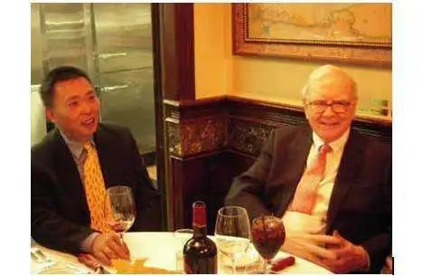

段永平和巴菲特

很多人都问，花那么多钱，就为和巴菲特吃顿饭，是不是值得？

段永平觉得非常值。他说：

“其实巴菲特说的很多东西都是我知道的，为什么还要花这么多钱去跟他聊天？这件事情就像很多人每个礼拜都会去教堂，很多东西他们早就知道，为什么还要去呢？这里面有些东西可以去琢磨。一个人如果做投资的话，拿出身家的百分之几去跟巴菲特这样的人聊聊天是很值得的。巴菲特在股东大会上的历次演讲都非常值得一看，他对投资的理解已经深入骨髓。”（摘自段永平在中欧创业营的演讲，原载《五问段永平》，《中欧杂志》2013年5月刊，编辑邓中华、罗真）

在另一场合，他也说到：

“其实我并没有把这顿午餐当成生意，就是想给他老人家捧个场，告诉世人，他的东西确实有价值。”（见《段永平的美国路》，《中国企业家》杂志，2007，记者李珉）

在巴菲特午餐上，他还带了一个小兄弟一起去。这个出生于80后的小兄弟，是丁磊介绍给他的，也是浙大的学弟，威斯康星大学计算机硕士毕业后，在谷歌工作。

日后，这个小兄弟将创造一家全新的电商公司，打破阿里巴巴和京东两强相争的局面，并于2020年成为仅次于马云和马化腾的中国第三大富豪。他就是拼多多创始人黄峥。

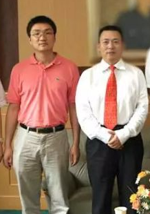

黄峥和段永平

黄峥和段永平的结识，也是一段奇缘。

2002年，黄峥在寝室上网，通过MSN添加了一位陌生网友。这位网友向他请教一个技术问题。黄峥学的是计算机，平时喜欢在网上发一些文章，这位网友恰巧看过了。黄峥帮网友解决了问题，网友非常感谢，顺手给黄峥一点小小的回报，改变了黄峥的整个人生。这位陌生网友就是丁磊。

黄峥帮助丁磊解决技术难题后，丁磊出于对黄峥的欣赏和感谢，看到黄峥要去美国留学，就把他引荐给了段永平。

我们无从得知段永平和黄峥第一次见面的情形，只知道，黄峥此后的人生，就再也和段永平脱不开关系。

2004年黄峥硕士毕业找工作时，向段永平请教何去何从，段永平指点他加入了谷歌。

2006年段永平和巴菲特吃饭，可以带一个人同行，他就带了黄峥。

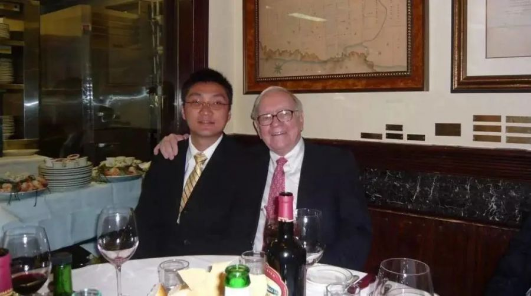

黄峥和巴菲特

2007年，黄峥开始创业，段永平大力支持，直接从步步高分了一块业务给黄峥做，帮助黄峥首次创业就站稳了脚跟。

其后黄峥创立其他公司，一直到2015年创立拼多多，段永平都无数次指点、出谋划策，甚至直接出资。可以说，没有段永平，就不会有黄峥的今天。

段永平毫不吝啬对黄峥的赞誉。他说：“我和黄峥是10多年的朋友了，我了解他、相信他。黄峥是我知道的少见的很有悟性的人……我对黄峥有很高的信任度! 给他10年时间，大家会看到他厉害的地方的。”

前不久，有些文章说段永平否认了“四大门徒”的说法，说段永平不认可黄峥是他的弟子。起因是他在雪球上说：“黄峥和我确实是很熟的朋友……也经常在一起聊天，但总觉得弟子的说法不合适”。

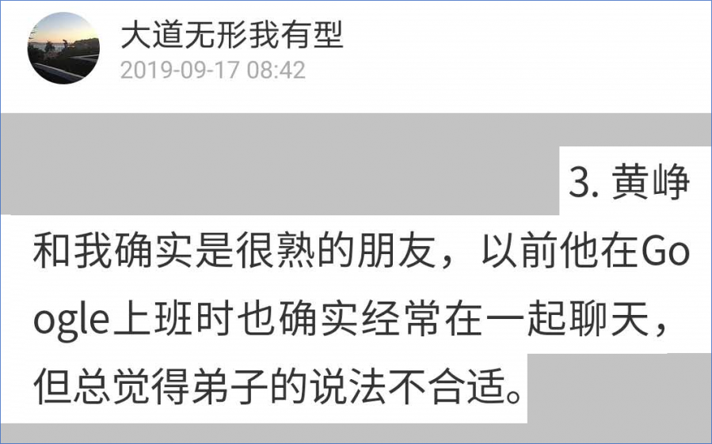

但实际上，就在这条消息发出后不久，其实他又补充了如下一条：

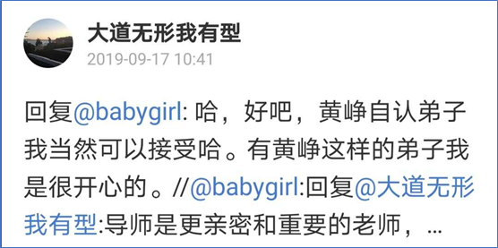

在黄峥这边，也的确可以算得上是“执弟子礼”。他公开宣称段永平是他的“人生导师”，并说：“在我的天使投资人里面，对我影响最大的是段永平。他不停在教育我首先要做正确的事，然后再把事情做正确。”

所以，黄峥建立拼多多，也把段永平那一套学了个遍。例如巨额投放广告，用魔音贯耳的音乐来洗脑，把“本分”写进价值观等等。

甚至连他的低调也学的有模有样，公司上市也不去敲钟，上市后也几乎不公开露面，让黄峥也成为中国互联网知名企业中，最神秘的一个创始人。

这一点，和金志江、陈明永、沈炜一样，正是从段永平这里一脉相承下来的。

## 7

随着段永平买股票尽量避免报备以来，外界对他财富的猜测早已如一片迷雾。谁也不知道他到底有多少钱。

不过，段永平想要低调，已经成为一件不可能做到的事情。原因在于他的大手笔慈善捐款。

就在拍下巴菲特慈善午餐的同一年，段永平给母校浙江大学捐款3000万美元，丁磊也陪同他一起捐了1000万美元，按当时汇率，俩人加起来总捐款合人民币3亿多，是当时中国内地高校历史上收到的最大笔捐款，在网上也引起了比“巴菲特午餐”更大的热议。

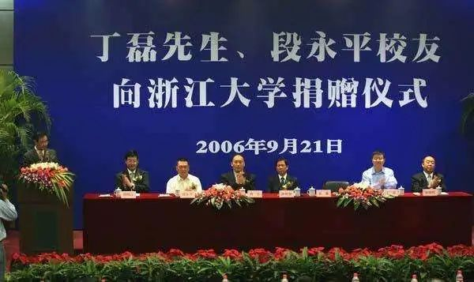

由于中国人民大学也是段永平的母校，有人问段永平：你为什么捐浙大不捐人大？

段永平说：干你丫什么事？

——他特别讨厌有人对别人的捐款说三道四。以至于在公开采访中讲述此事时，把这句粗口也说出来，这也是我看到他的所有公开影像资料中，唯一一句骂粗口。（见腾讯视频《段永平与浙大学子面对面交流》）

不过2010年，段永平也和太太刘昕一起，向人民大学捐款3000万美元。

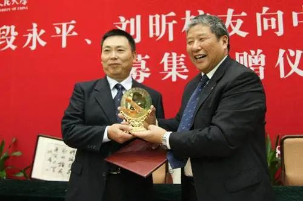

两笔加起来6000万美元，也让段永平成为中国向母校捐款最多的校友之一。

与大部分国内高校捐助不一样的是，段永平采取了两个在当时堪称别出心裁的做法：

一是捐助基金的很大一部分是等额配比基金，也就是说，他捐助的资金只是放在盘子里，校方必须从其他渠道拿到特定用途的捐款（如用于师生人才培养或基建），才能从段永平的基金会里取出同等金额的资金。

二是采用贷学金而非助学金，也就是说，发给学生的奖学金不是无偿的，而是要参考银行同期利息，在离校后十年内归还。

目前，段永平夫妇旗下的基金会主要有两个。一个是在美国设立的家族基金会Inlight Foundation，以刘昕之名注册，资料显示，2018年该基金会拥有资产5500万美元。

另一个是在中国设立的心平公益基金会（心平这个名字，为刘昕和段永平各取一字的谐音），浙江大学、中国人民大学、江西师范大学、北京师范大学等高校的“心平贷学金”、“心平奖教金”主要来源于此。

为了让捐出去的钱真正发挥作用，段永平花了非常多的心思，他甚至多次表示，做慈善才是他当前的主要事业，投资只是爱好。他认为，慈善不容易，花钱比赚钱难多了。

对于“花钱比赚钱难”这个观点，从前我们也听马云等其他富豪说过，但总觉得他们是在装逼。不过听段永平解释以后，觉得还是挺有道理。他说：

“你要是站在有钱人那个位置上，你就明白了：赚钱是在你自己熟悉的领域，可以非常聚焦地去做事，花钱呢，你要面对不同的新问题。”（见《段永平：平心“投善” 》，《中国企业家》杂志2010年，记者蔡钰）

说到底，那些不理解这个问题的人（包括我），还是因为没钱。

## 8

2020年，段永平59岁。

如今，他的弟子金志江掌舵的步步高教育电子，一直牢牢占据着点读机等教育产品的第一位置；

他的弟子陈明永掌舵的OPPO，2020年一季度全国手机出货量的第一名；

他的弟子沈炜掌舵的vivo，2020年一季度全国手机出货量的第二名；

他的弟子黄峥掌舵的拼多多，2020年一季度中国电商行业活跃用户数和市值的第二名。

而段永平自己，则只是陪陪老婆孩子，打打高尔夫，玩玩游戏，看看股票，做做慈善。没事的时候，也在网上讲一讲投资的事，和网友互动一下。以前是在网易博客，现在主要在雪球。他的雪球号名叫“大道无形我有型”。

在微博上，他也有一个同名的号，只是已经不大更新。其简介只有两个字：“闲人”。

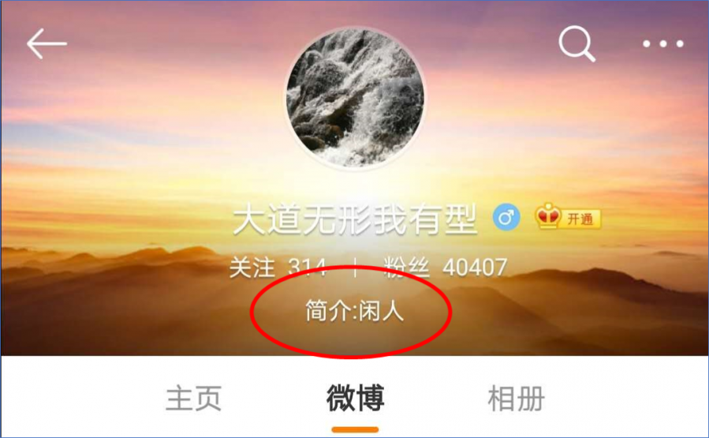

段永平微博

在《红楼梦》里，宝玉等一群人因为组织海棠诗社，要各取一个名号，宝钗对宝玉说：

“还是我送你个号吧。有最俗的一个号，却于你最当：天下难得的是富贵，又难得的是闲散，这两样再不能兼，不想你兼有了，就叫你‘富贵闲人’也罢了。”

段永平，其斯之谓欤？

我只想说，好羡慕。
