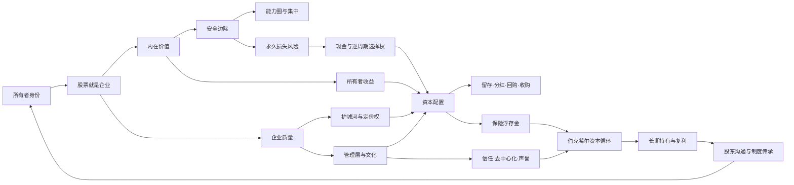

# 《所有者的眼光》思想体系关系图

```mermaid
flowchart LR
  A["所有者身份"] --> B["股票就是企业"]
  B --> C["内在价值"]
  C --> D["安全边际"]
  D --> E["能力圈与集中"]
  B --> F["企业质量"]
  F --> G["护城河与定价权"]
  F --> H["管理层与文化"]
  C --> I["所有者收益"]
  I --> J["资本配置"]
  G --> J
  H --> J
  J --> K["留存·分红·回购·收购"]
  J --> L["保险浮存金"]
  L --> M["伯克希尔资本循环"]
  H --> N["信任·去中心化·声誉"]
  N --> M
  D --> O["永久损失风险"]
  O --> P["现金与逆周期选择权"]
  P --> J
  M --> Q["长期持有与复利"]
  Q --> R["股东沟通与制度传承"]
  R --> A
```

图的阅读方向：从所有者身份出发，经企业判断和价值判断进入资本配置；保险与制度把资本配置变成伯克希尔的长期循环，最终回到股东责任。
