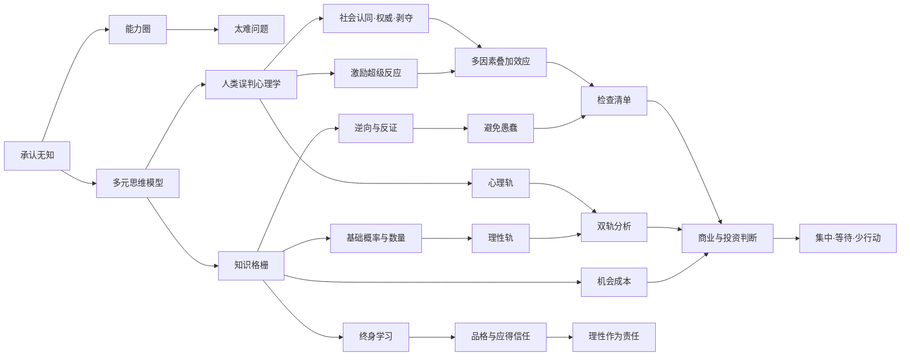

# 《理性的格栅》思想体系关系图

```mermaid
flowchart LR
  A["承认无知"] --> B["能力圈"]
  B --> C["太难问题"]
  A --> D["多元思维模型"]
  D --> E["知识格栅"]
  E --> F["基础概率与数量"]
  E --> G["机会成本"]
  E --> H["逆向与反证"]
  H --> I["避免愚蠢"]
  D --> J["人类误判心理学"]
  J --> K["激励超级反应"]
  J --> L["社会认同·权威·剥夺"]
  K --> M["多因素叠加效应"]
  L --> M
  F --> N["理性轨"]
  J --> O["心理轨"]
  N --> P["双轨分析"]
  O --> P
  G --> Q["商业与投资判断"]
  P --> Q
  Q --> R["集中·等待·少行动"]
  I --> S["检查清单"]
  M --> S
  S --> Q
  E --> T["终身学习"]
  T --> U["品格与应得信任"]
  U --> V["理性作为责任"]
```

图的阅读方向：格栅提供知识结构，心理学揭示系统性错误；二者通过双轨分析和检查清单进入商业、投资与人生判断。
