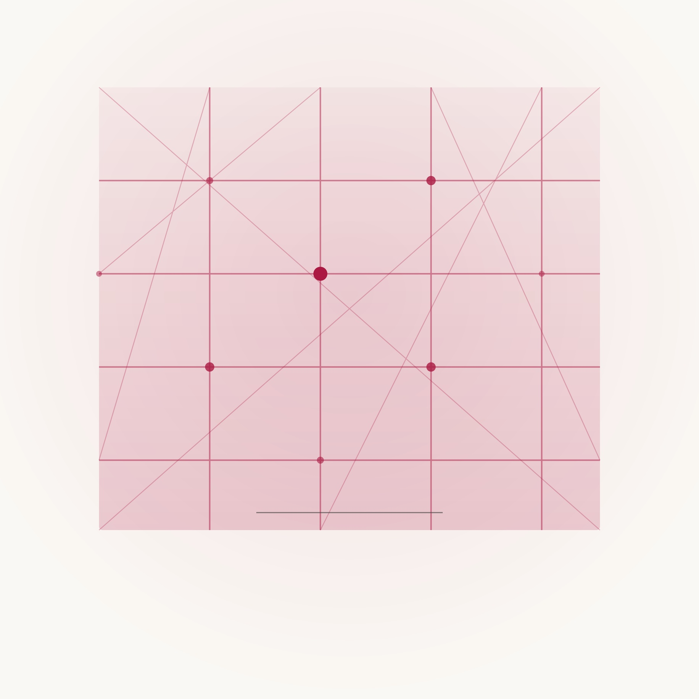
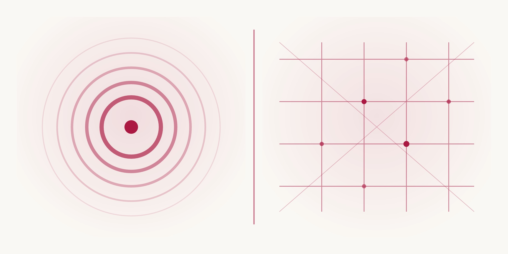
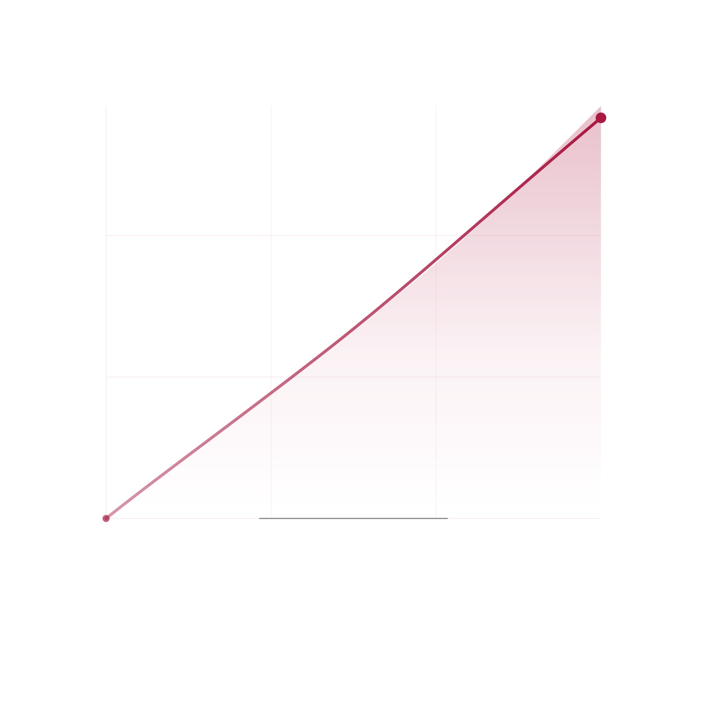
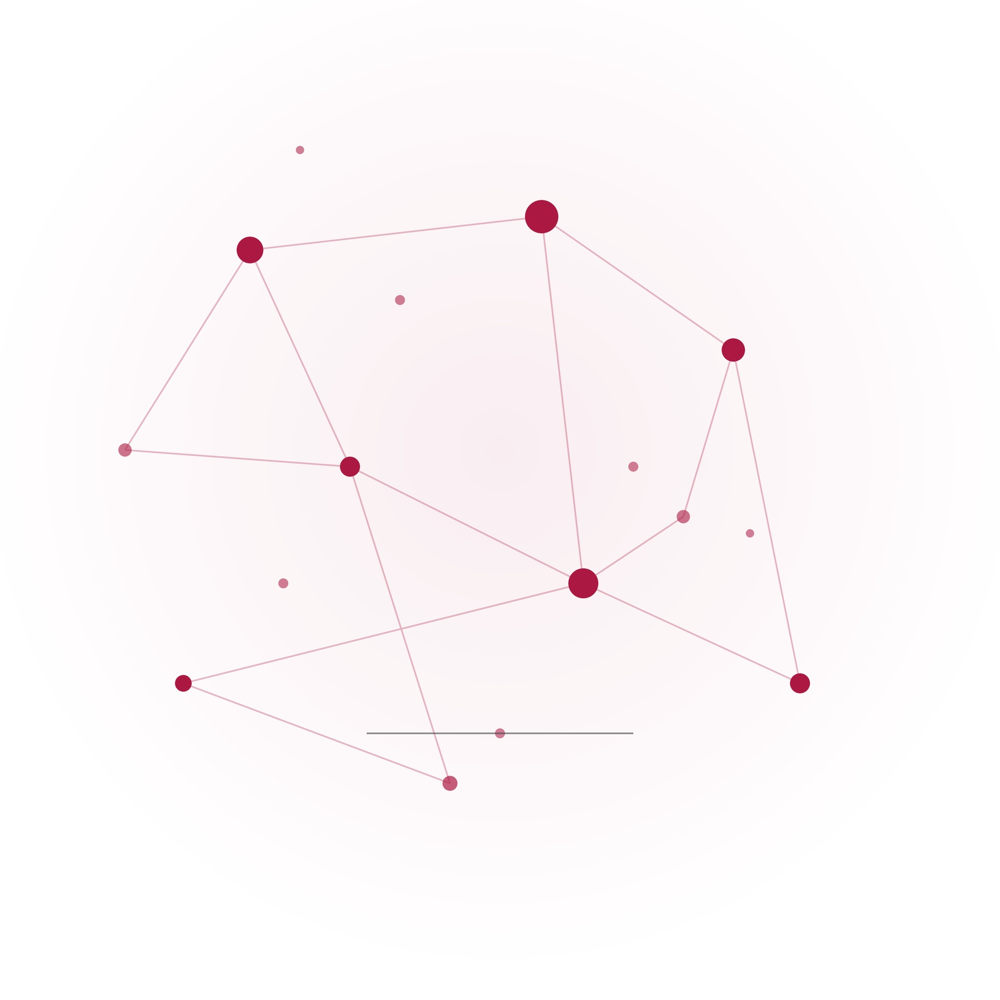
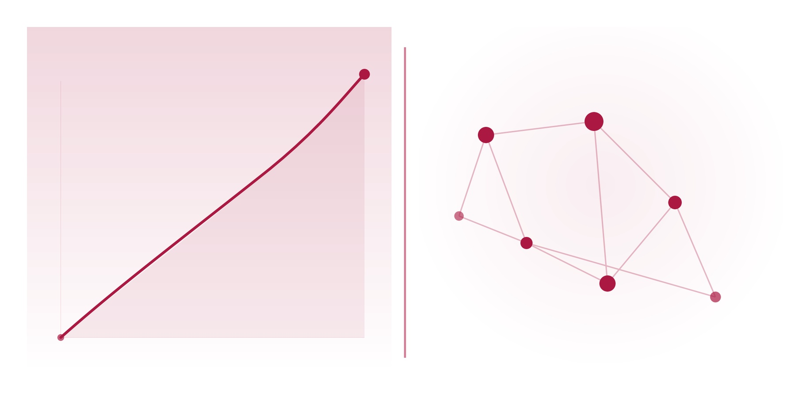
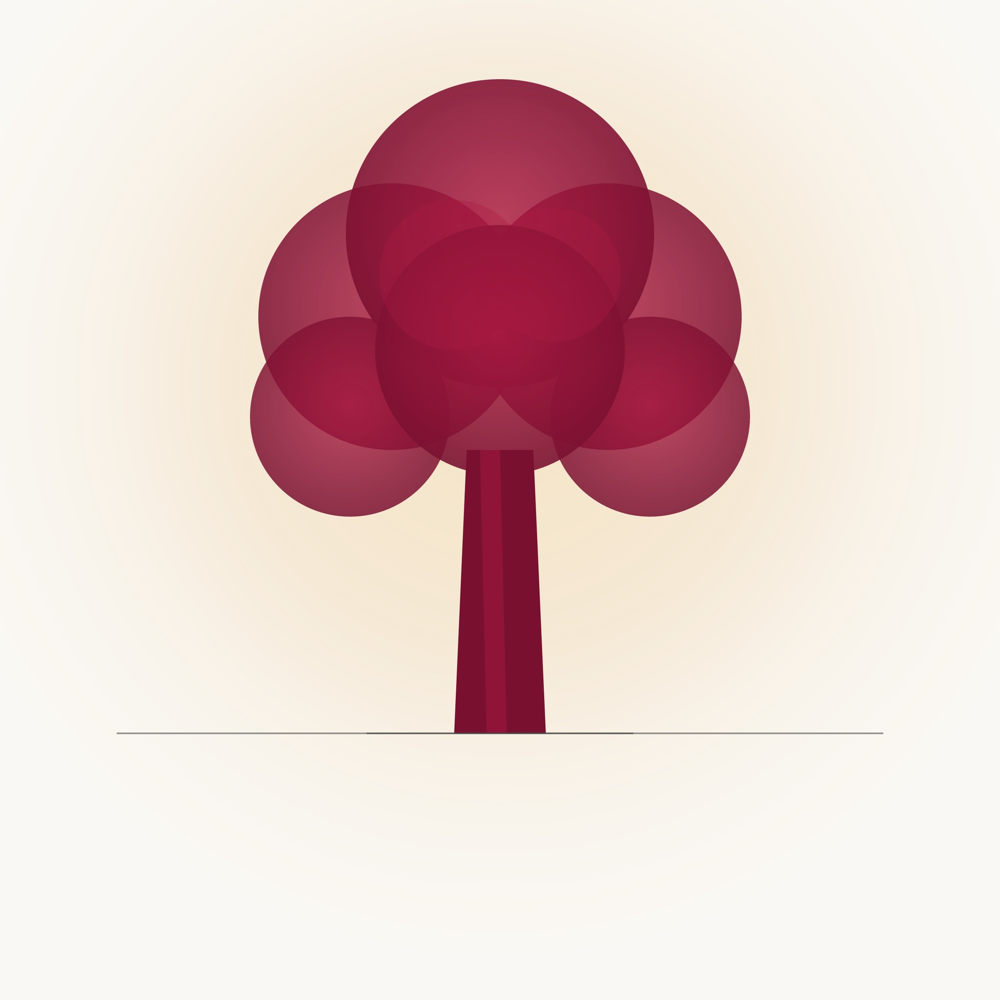
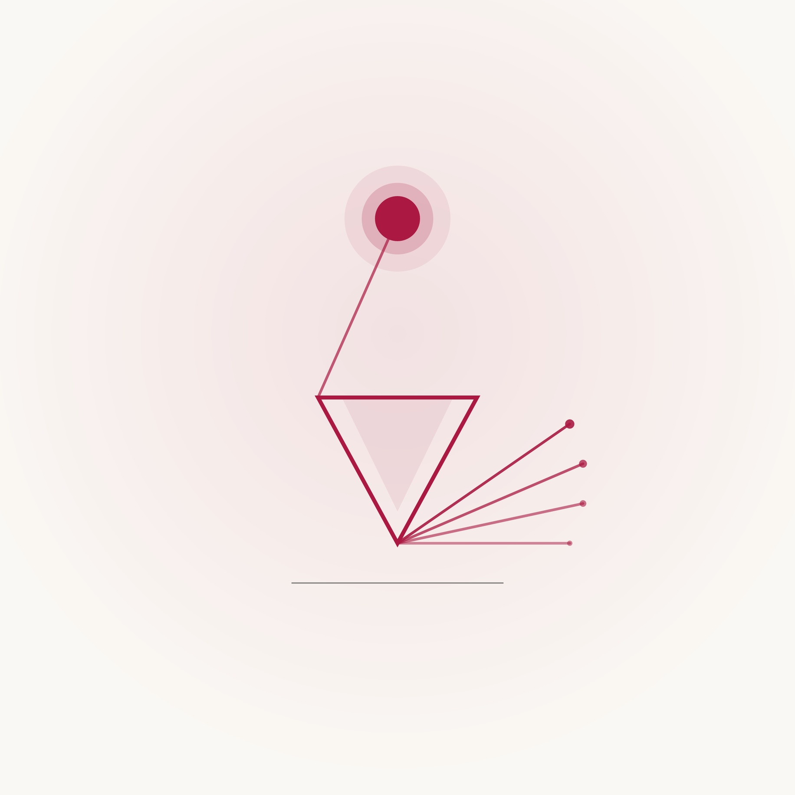
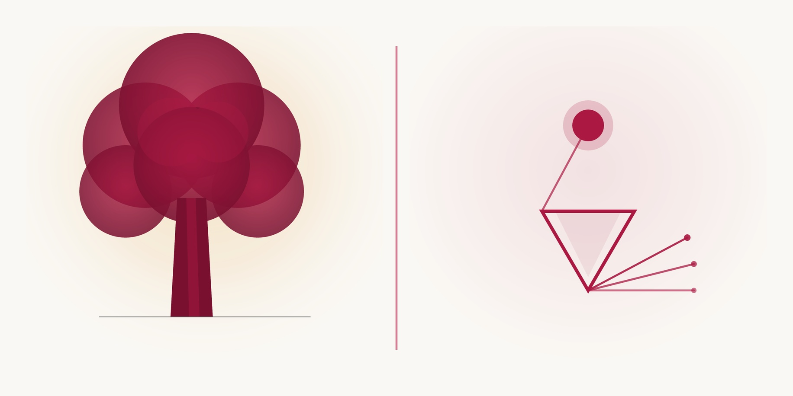

# 双书封面设计方案

> 生成：2026-08-02
> 品牌主色：`#AB1942`
> 系列名：复利书房·巴芒经典

---

## 方案一：经典文献型

### 定位
经典、厚重、可收藏。以文献典籍的视觉语言传递"经典"感，适合长期保存和反复阅读的读者。

### 图形母题
- **巴菲特卷**：抽象树轮纹理。年轮代表长期复利、所有者价值的逐年积累，呼应"所有者的眼光"中时间与复利的主题。
- **芒格卷**：互联格栅/网格。经纬交叉的线条代表多元思维模型和跨学科知识连接，呼应"理性的格栅"中知识结构化的主题。

### 双书并列效果
树轮的有机圆环与格栅的几何直线形成视觉对比，但统一在深红+奶油纸白的配色中，形成"有机vs理性"的系列张力。

### 色彩方案
- 底色：奶油纸白 `#FAF8F4`
- 主图形：深红 `#AB1942`
- 装饰线：深灰 `#454545`

### 字体建议
- 主标题：思源宋体 Bold，28pt，品牌红 `#AB1942`
- 副标题：思源黑体 Regular，12pt，深灰 `#454545`
- 系列标识：思源黑体 Regular，8pt，中灰 `#8A8A8A`

### 封面布局（从上到下）
1. 系列标识"复利书房·巴芒经典"（8pt，中灰，居中）
2. 留白
3. 主图形（树轮/格栅，品牌红，居中）
4. 留白
5. 主标题（思源宋体 Bold，28pt，品牌红，居中）
6. 副标题（思源黑体 Regular，12pt，深灰，居中）
7. 留白
8. 编者信息（思源黑体 Regular，8pt，中灰，居中）

### 书脊
- 纯色品牌红 `#AB1942`
- 主标题纵向排列（思源宋体 Bold，白色）
- 系列标识小字（思源黑体 Regular，米白色，底部）

### 封底
- 品牌红 `#AB1942` 细边框
- 内容简介（思源宋体 Regular，10pt，深灰）
- 条形码位置（底部右下）

### 印刷工艺
- 封面：250g 哑粉纸，覆亚膜
- 主图形：烫深红金（品牌色）
- 主标题：起凸
- 书脊：烫红金

### 电商缩略图
缩小后书名仍可辨识，主图形在缩略中形成品牌识别符号。

### 版权与肖像风险
- 无人物肖像，零风险
- 图形为抽象设计，无第三方版权

### 图像生成提示词
```
Minimalist book cover design, deep burgundy #AB1942 and cream paper #FAF8F4 palette,
abstract tree rings as central motif representing compounding and ownership,
aged linen paper texture, classic literary style, no text whatsoever,
clean layout with ample negative space, professional publishing quality,
premium hardcover look
```

### 负面提示词
```
text, letters, words, typography, gold, coins, money, dollar, stock chart,
person, face, celebrity, glossy, gradient, photograph, 3D render, low quality
```

### 文件
- 巴菲特卷：`editorial/shared/brand-assets/cover-v1-buffett.jpg`（源文件 `cover-v1-buffett.svg`）
- 芒格卷：`editorial/shared/brand-assets/cover-v1-munger.jpg`（源文件 `cover-v1-munger.svg`）
- 双书并列：`editorial/shared/brand-assets/cover-v1-sidebyside.jpg`（源文件 `cover-v1-sidebyside.svg`）

  

---

## 方案二：现代思想图谱型

### 定位
现代、简洁、知识导向。以当代思想类书籍的视觉语言吸引年轻读者和知识工作者。

### 图形母题
- **巴菲特卷**：抽象流动曲线。代表资本流动、企业估值与现金流的动态变化，以极简曲线表达"所有者"视角下的经济现实。
- **芒格卷**：节点与连接网络。代表知识图谱和思维模型的结构化组织，以几何点线表达"理性"的可视化。

### 双书并列效果
流动曲线与节点网络在视觉上互补——曲线代表"过程与价值流动"，节点代表"结构与知识连接"，统一在极简几何风格中。

### 色彩方案
- 底色：纯白 `#FFFFFF`
- 主图形：品牌红 `#AB1942`
- 辅助线：深灰 `#454545`

### 字体建议
- 主标题：思源黑体 Bold，26pt，品牌红 `#AB1942`
- 副标题：思源黑体 Regular，11pt，深灰 `#454545`
- 系列标识：思源黑体 Regular，7pt，中灰 `#8A8A8A`

### 封面布局
与方案一相同，但主图形位置更靠上，留白更多，体现现代感。

### 书脊
- 纯白底色，品牌红细竖线
- 主标题纵向（思源黑体 Bold，品牌红）

### 封底
- 纯白底色，品牌红细边框
- 简洁内容简介

### 印刷工艺
- 封面：300g 铜版纸，覆光膜
- 主图形：UV 局部光油
- 主标题：烫黑金

### 图像生成提示词
```
Minimalist book cover design, modern financial thought style,
deep burgundy #AB1942 and off-white palette,
abstract flowing lines and curves representing capital flows and business valuation,
matte paper finish texture, ultra-clean layout with maximum negative space,
no text whatsoever, professional book cover quality, premium hardcover aesthetic
```

### 负面提示词
```
text, letters, words, typography, gold, coins, money, dollar, stock chart,
person, face, celebrity, glossy, photograph, 3D render, low quality
```

### 文件
- 巴菲特卷：`editorial/shared/brand-assets/cover-v2-buffett.jpg`（源文件 `cover-v2-buffett.svg`）
- 芒格卷：`editorial/shared/brand-assets/cover-v2-munger.jpg`（源文件 `cover-v2-munger.svg`）
- 双书并列：`editorial/shared/brand-assets/cover-v2-sidebyside.jpg`（源文件 `cover-v2-sidebyside.svg`）

  

---

## 方案三：时间与人物精神型

### 定位
诗意、沉思、精神气质。以自然意象和光的隐喻传递人物精神内核，适合追求"阅读体验"而非"工具书"的读者。

### 图形母题
- **巴菲特卷**：内布拉斯加平原上的橡树，金色黄昏。代表长期增长、根基深厚、经历了时间考验的价值。橡树是奥马哈的精神象征，也是巴菲特"长期持有"的自然隐喻。
- **芒格卷**：光线穿过棱镜分解为光谱。代表理性思维将复杂问题拆解为清晰结构，以及"理性近乎一种道德义务"的精神追求。

### 双书并列效果
橡树（自然+时间）与棱镜（理性+光）形成"经验vs理性"的深层对话。两本书放在一起，代表巴菲特和芒格互补的两种智慧。

### 色彩方案
- 底色：暖奶油色 `#FAF8F4`
- 主图形：品牌红 `#AB1942` + 暖金色调
- 氛围：金色黄昏光晕

### 字体建议
- 主标题：思源宋体 Bold，28pt，品牌红 `#AB1942`
- 副标题：思源宋体 Regular，12pt，深灰 `#454545`
- 系列标识：思源黑体 Regular，8pt，中灰 `#8A8A8A`

### 封面布局
- 主图形占据封面中部和上部，大面积留白
- 标题位于下部，与图形形成"上天入地"的构图

### 书脊
- 品牌红 `#AB1942` 底色
- 主标题纵向（思源宋体 Bold，白色）

### 封底
- 暖奶油色底色
- 品牌红细线
- 内容简介 + 引文摘录

### 印刷工艺
- 封面：250g 米白艺术纸，不覆膜
- 主图形：四色印刷 + 专色红
- 主标题：烫红金 + 起凸

### 图像生成提示词
```
Minimalist book cover design, timeless character spirit style,
deep burgundy #AB1942 and warm cream palette,
a single majestic oak tree on a quiet Nebraska plain at golden hour,
soft atmospheric lighting, representing long-term growth and enduring value,
artistic and contemplative mood, no text whatsoever,
ample negative space, premium hardcover quality, fine art aesthetic
```

### 负面提示词
```
text, letters, words, typography, gold, coins, money, dollar, stock chart,
person, face, celebrity, glossy, gradient, photograph, 3D render, low quality
```

### 文件
- 巴菲特卷：`editorial/shared/brand-assets/cover-v3-buffett.jpg`（源文件 `cover-v3-buffett.svg`）
- 芒格卷：`editorial/shared/brand-assets/cover-v3-munger.jpg`（源文件 `cover-v3-munger.svg`）
- 双书并列：`editorial/shared/brand-assets/cover-v3-sidebyside.jpg`（源文件 `cover-v3-sidebyside.svg`）

  

---

## 方案比较与推荐

| 维度 | 方案一（经典文献型） | 方案二（现代思想图谱型） | 方案三（时间与人物精神型） |
|------|------|------|------|
| 主题准确性 | ★★★★★ | ★★★★ | ★★★★★ |
| 系列感 | ★★★★★ | ★★★★★ | ★★★★ |
| 人物区分度 | ★★★★ | ★★★★ | ★★★★★ |
| 缩略图识别 | ★★★★ | ★★★★★ | ★★★★ |
| 印刷友好 | ★★★★★ | ★★★★ | ★★★★ |
| 数字版适配 | ★★★★ | ★★★★★ | ★★★★ |
| 目标读者匹配 | 收藏型/经典读者 | 知识型/现代读者 | 文学型/沉思读者 |

### 推荐：方案一（经典文献型）

理由：
1. "复利书房·巴芒经典"的系列名本身就指向"经典"，方案一的视觉语言最匹配
2. 树轮 vs 格栅的对比在视觉上清晰传达了两位人物的核心差异（有机积累 vs 结构化理性）
3. 双书并列时系列感最强，单独使用时人物区分度足够
4. 设计语言克制、不张扬，符合"内部非公开思想读本"的定位

---

## 附录：封面文字排版说明（排版阶段叠加）

### 正封面
```
[系列标识] 复利书房·巴芒经典          ← 思源黑体 Regular 8pt 中灰#8A8A8A


              [主图形]                   ← 居中


  所有者的眼光  /  理性的格栅             ← 思源宋体 Bold 28pt 品牌红#AB1942
巴菲特论企业、资本与长期复利              ← 思源黑体 Regular 12pt 深灰#454545
芒格论思维模型、商业判断与人生智慧


    [编者信息]                          ← 思源黑体 Regular 8pt 中灰#8A8A8A
```

### 书脊（纵向，从上到下）
```
 复 利 书 房
 ·
 巴 芒 经 典      ← 思源黑体 Regular 6pt 米白色

 所 有 者 的 眼 光  ← 思源宋体 Bold 14pt 白色
 理 性 的 格 栅

  [品牌红纯色底色]
```